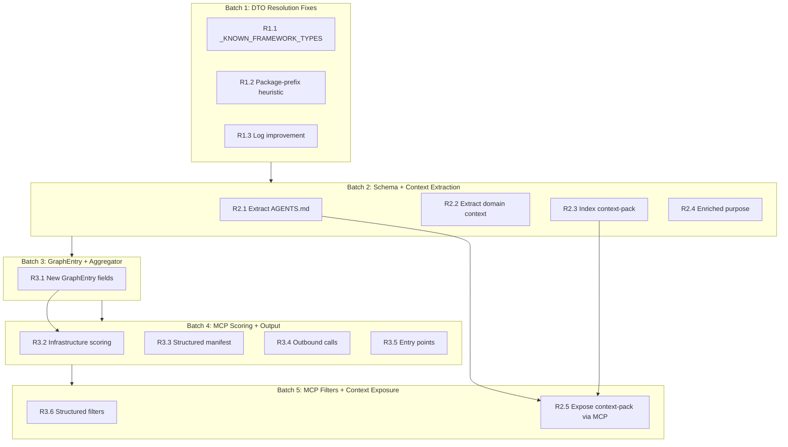
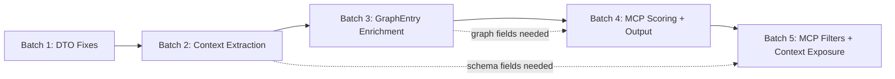

# Comprehensive Improvement Plan — Platform Cortex

> **14 improvements across 3 areas, organized into 5 implementation batches.**
>
> Each batch is designed to be independently testable and deployable.

---

## Table of Contents

- [Overview](#overview)
- [Improvement Index](#improvement-index)
- [Architecture Diagram](#architecture-diagram)
- [Batch 1 — DTO Resolution Fixes](#batch-1--dto-resolution-fixes)
- [Batch 2 — Schema & Context Extraction](#batch-2--schema--context-extraction)
- [Batch 3 — GraphEntry & Aggregator Enrichment](#batch-3--graphentry--aggregator-enrichment)
- [Batch 4 — MCP Server Scoring & Structured Output](#batch-4--mcp-server-scoring--structured-output)
- [Batch 5 — MCP Server Filters & Context-Pack Exposure](#batch-5--mcp-server-filters--context-pack-exposure)
- [Cross-Cutting Concerns](#cross-cutting-concerns)

---

## Overview

The Cortex project extracts architectural metadata from Android, iOS, and backend Java repositories, aggregates it into a queryable graph, and exposes it to AI agents via an MCP server. These 14 improvements enhance three areas:

1. **DTO Resolution Fixes** — Reduce false-positive DTO extraction in `backend_java.py`
2. **Context Extraction** — Extract agent context, domain context, and context-pack files from repos
3. **MCP Server & Graph Improvements** — Enrich the graph, improve search scoring, and expose new data via existing MCP tools

### Constraints

- **Exactly 4 MCP tools** — never add a 5th (anti-requirement #6)
- **Schema changes must update BOTH** [`schemas/manifest.schema.json`](schemas/manifest.schema.json) AND [`src/cortex/schema.py`](src/cortex/schema.py)
- All changes must pass `uv run pytest tests/ mcp_server/tests/ -v`
- Coverage must stay above 75%

---

## Improvement Index

| ID | Area | Title | Batch | Files Modified |
|----|------|-------|-------|----------------|
| R1.1 | DTO | `_KNOWN_FRAMEWORK_TYPES` exclusion set | 1 | `backend_java.py`, tests |
| R1.2 | DTO | Package-prefix heuristic | 1 | `backend_java.py`, tests |
| R1.3 | DTO | Log improvement | 1 | `backend_java.py` |
| R2.1 | Context | Extract AGENTS.md / CLAUDE.md | 2 | `schema.py`, `base.py`, extractors, `manifest.schema.json`, tests |
| R2.2 | Context | Extract domain context | 2 | `schema.py`, `base.py`, extractors, `manifest.schema.json`, tests |
| R2.3 | Context | Index context-pack files | 2 | `schema.py`, `base.py`, extractors, `manifest.schema.json`, tests |
| R2.4 | Context | Auto-generate enriched purpose | 2 | `base.py`, extractors, tests |
| R3.1 | Graph | Add fields to GraphEntry + aggregator | 3 | `schema.py`, `aggregator.py`, tests |
| R3.2 | MCP | Infrastructure scoring | 4 | `server.py`, tests |
| R3.3 | MCP | Structured manifest in get_service_context | 4 | `server.py`, tests |
| R3.4 | MCP | Outbound calls in get_service_context | 4 | `server.py`, tests |
| R3.5 | MCP | Entry points in get_service_context | 4 | `server.py`, tests |
| R3.6 | MCP | Structured filters in find_relevant_services | 5 | `server.py`, tests |
| R2.5 | MCP | Expose context-pack via MCP | 5 | `server.py`, tests |

---

## Architecture Diagram



---

## Batch 1 — DTO Resolution Fixes

**Scope:** [`src/cortex/extractors/backend_java.py`](src/cortex/extractors/backend_java.py) only + tests

### R1.1 — Add `_KNOWN_FRAMEWORK_TYPES` exclusion set

**Goal:** Prevent well-known framework/library class names from being treated as DTOs.

**File:** [`src/cortex/extractors/backend_java.py`](src/cortex/extractors/backend_java.py)

**Changes:**

1. **Add new `frozenset` at module level** (after [`_KNOWN_ANNOTATION_NAMES`](src/cortex/extractors/backend_java.py:102) at line ~137):

```python
# Well-known framework/library class names — never treat as DTOs.
# These are injected dependencies, infrastructure types, or utility classes
# that may appear as constructor parameters or field types but are not DTOs.
_KNOWN_FRAMEWORK_TYPES = frozenset({
    # Spring Framework
    "ApplicationEventPublisher", "ApplicationContext", "Environment",
    "BeanFactory", "ConversionService", "MessageSource", "ResourceLoader",
    "TaskExecutor", "TaskScheduler", "WebClient", "RestTemplate", "RestClient",
    "JdbcTemplate", "NamedParameterJdbcTemplate", "TransactionTemplate",
    "PlatformTransactionManager", "ObjectMapper", "ObjectProvider",
    "RedisTemplate", "StringRedisTemplate", "ReactiveRedisTemplate",
    # Java stdlib
    "ScheduledExecutorService", "ExecutorService", "Executor", "Clock",
    "Timer", "TimerTask", "ThreadPoolExecutor", "CompletionService",
    "CountDownLatch", "Semaphore", "ConcurrentHashMap",
    "AtomicInteger", "AtomicLong", "AtomicBoolean", "AtomicReference",
    "Logger", "Pattern", "Matcher", "Locale", "TimeZone", "Currency",
    "Properties", "Random", "SecureRandom", "MessageDigest", "Cipher",
    "KeyStore", "SSLContext", "Path", "File", "Reader", "Writer",
    "BufferedReader", "PrintWriter", "Charset", "StandardCharsets",
    # Spring Kafka
    "KafkaTemplate", "KafkaAdmin", "KafkaListenerContainerFactory",
    "ConsumerFactory", "ProducerFactory", "KafkaOperations",
    "StreamsBuilder", "KafkaStreamsConfiguration",
    # Spring Security
    "AuthenticationManager", "SecurityContext", "Authentication",
    "UserDetails", "GrantedAuthority", "SecurityFilterChain",
    "HttpSecurity", "WebSecurityCustomizer",
    # Spring Data
    "CrudRepository", "JpaRepository", "PagingAndSortingRepository",
    "MongoTemplate", "ReactiveMongoTemplate", "CosmosRepository",
    "CosmosTemplate", "Pageable", "Page", "Sort", "Specification",
    # Servlet API
    "HttpSession", "ServletContext", "FilterChain", "Cookie",
    "HttpHeaders", "MediaType", "HttpStatus",
})
```

2. **Update [`_is_valid_dto_name()`](src/cortex/extractors/backend_java.py:3057)** (line ~3071) to include the new set:

```python
# Current (line 3071):
if (name in _PRIMITIVE_TYPES or name in _RESPONSE_WRAPPERS
        or name in _KNOWN_ANNOTATION_NAMES):
    return False

# New:
if (name in _PRIMITIVE_TYPES or name in _RESPONSE_WRAPPERS
        or name in _KNOWN_ANNOTATION_NAMES or name in _KNOWN_FRAMEWORK_TYPES):
    return False
```

3. **Update [`_resolve_dto_types()`](src/cortex/extractors/backend_java.py:2959)** (line ~2974) to also check the new set:

```python
# Current (line 2974):
if name in schemas or name in _PRIMITIVE_TYPES:
    continue

# New:
if name in schemas or name in _PRIMITIVE_TYPES or name in _KNOWN_FRAMEWORK_TYPES:
    continue
```

And at line ~2998:
```python
# Current:
new_types -= _PRIMITIVE_TYPES

# New:
new_types -= _PRIMITIVE_TYPES
new_types -= _KNOWN_FRAMEWORK_TYPES
```

### R1.2 — Package-prefix heuristic

**Goal:** Catch framework types not in the static exclusion list by checking import statements.

**File:** [`src/cortex/extractors/backend_java.py`](src/cortex/extractors/backend_java.py)

**Changes:**

1. **Add framework package prefixes constant** (near the other constants, after `_KNOWN_FRAMEWORK_TYPES`):

```python
# Package prefixes that indicate a class is a framework/library type, not a DTO.
# Used as a secondary filter when a class IS found in the class index but
# its import resolves to a known framework package.
_FRAMEWORK_PACKAGE_PREFIXES = (
    "java.", "javax.", "jakarta.",
    "org.springframework.", "org.apache.kafka.",
    "com.fasterxml.jackson.", "io.swagger.",
    "org.slf4j.", "lombok.",
)
```

2. **Add helper method to check imports** in the `BackendJavaExtractor` class:

```python
def _is_framework_import(self, class_name: str, file_path: Path) -> bool:
    """Check if a class name resolves to a framework package via import statements.

    Reads the file at file_path and checks if any import statement for class_name
    starts with a known framework package prefix.
    """
    try:
        content = file_path.read_text(errors="replace")
    except Exception:
        return False

    for line in content.splitlines():
        line = line.strip()
        if not line.startswith("import "):
            continue
        # import com.fasterxml.jackson.databind.ObjectMapper;
        # import static org.springframework...;
        import_path = line.removeprefix("import ").removeprefix("static ").rstrip(";").strip()
        # Check if this import ends with the class name
        if import_path.endswith("." + class_name) or import_path.endswith(".*"):
            pkg = import_path.rsplit(".", 1)[0] + "."
            if any(pkg.startswith(prefix) for prefix in _FRAMEWORK_PACKAGE_PREFIXES):
                return True
    return False
```

3. **Apply in [`_resolve_dto_types()`](src/cortex/extractors/backend_java.py:2959)** after the `class_index.get(name)` lookup (line ~2977):

```python
file_path = class_index.get(name)
if file_path is None:
    logger.debug("DTO class not found in repo", class_name=name)
    continue

# R1.2: Skip classes whose imports resolve to framework packages
if self._is_framework_import(name, file_path):
    skipped_framework.append(name)  # for R1.3 log improvement
    continue
```

### R1.3 — Log improvement

**Goal:** Replace per-class debug logging with a single summary line.

**File:** [`src/cortex/extractors/backend_java.py`](src/cortex/extractors/backend_java.py)

**Changes:**

1. **In [`_resolve_dto_types()`](src/cortex/extractors/backend_java.py:2959)**, collect unresolved names and log once:

```python
def _resolve_dto_types(self, type_names, class_index, root, schemas, depth):
    if depth >= _MAX_DTO_DEPTH:
        return

    new_types: set[str] = set()
    skipped: list[str] = []  # Collect unresolved/framework names

    for name in type_names:
        if name in schemas or name in _PRIMITIVE_TYPES or name in _KNOWN_FRAMEWORK_TYPES:
            continue

        file_path = class_index.get(name)
        if file_path is None:
            skipped.append(name)
            continue

        # R1.2: Package-prefix check
        if self._is_framework_import(name, file_path):
            skipped.append(name)
            continue

        schema = self._parse_java_class(file_path, root)
        if schema is None:
            continue

        schemas[name] = schema

        for field in schema.fields:
            self._add_dto_type_names(field.type, new_types)

        if schema.parent and schema.parent not in _PRIMITIVE_TYPES:
            new_types.add(schema.parent)

    # R1.3: Single summary log instead of per-class debug lines
    if skipped:
        logger.debug(
            "Skipped framework/unresolvable DTO types",
            count=len(skipped),
            names=sorted(skipped),
        )

    new_types -= set(schemas.keys())
    new_types -= _PRIMITIVE_TYPES
    new_types -= _KNOWN_FRAMEWORK_TYPES

    if new_types:
        self._resolve_dto_types(new_types, class_index, root, schemas, depth + 1)
```

### Batch 1 — Test Changes

**File:** [`tests/test_backend_java_extractor.py`](tests/test_backend_java_extractor.py)

1. **Test `_KNOWN_FRAMEWORK_TYPES` exclusion:**
   - Create a fixture Java file that has a constructor injecting `ObjectMapper`, `KafkaTemplate`, `JpaRepository`
   - Verify these are NOT included in `dto_schemas`
   - Verify that actual DTOs in the same repo ARE still extracted

2. **Test `_is_valid_dto_name()` rejects framework types:**
   - Parametrized test with names from `_KNOWN_FRAMEWORK_TYPES`
   - Assert all return `False`

3. **Test package-prefix heuristic:**
   - Create a fixture Java file with `import org.springframework.web.client.RestTemplate;`
   - Create a class file named `RestTemplate.java` in the fixture repo (simulating a name collision)
   - Verify the framework import check prevents it from being treated as a DTO

4. **Test log consolidation:**
   - Use `caplog` or mock `structlog` to verify a single debug log is emitted with count and names

### Batch 1 — Verification

```bash
uv run pytest tests/test_backend_java_extractor.py -v -k "framework_type or known_framework or package_prefix or log_summary"
uv run pytest tests/ mcp_server/tests/ -v
uv run cortex run-local --config config/repos-fixtures.yaml --output-dir /tmp/cortex-smoke
```

---

## Batch 2 — Schema & Context Extraction

**Scope:** Schema models, base extractor, all 3 extractors, manifest JSON schema, tests

### R2.1 — Extract AGENTS.md / CLAUDE.md

**Goal:** Read agent context files from repo root and store in manifest.

**Files to modify:**

1. **[`src/cortex/schema.py`](src/cortex/schema.py:210)** — Add field to `ServiceManifest` (after line ~267):

```python
# Context extraction fields
agent_context: str | None = None
```

2. **[`schemas/manifest.schema.json`](schemas/manifest.schema.json)** — Add property (before `"additionalProperties": false` at line ~435):

```json
"agent_context": {
  "type": ["string", "null"],
  "description": "Contents of AGENTS.md or CLAUDE.md from repo root"
}
```

3. **[`src/cortex/extractors/base.py`](src/cortex/extractors/base.py)** — Add method to `Extractor` class:

```python
def _extract_agent_context(self, repo_path: Path) -> str | None:
    """Read AGENTS.md or CLAUDE.md from repo root.

    Prefers AGENTS.md if both exist.
    """
    for filename in ("AGENTS.md", "CLAUDE.md"):
        filepath = repo_path / filename
        if filepath.is_file():
            try:
                return filepath.read_text(errors="replace").strip()
            except Exception:
                return None
    return None
```

4. **Each extractor's `extract()` method** — Call the new method and set the field:
   - [`src/cortex/extractors/backend_java.py`](src/cortex/extractors/backend_java.py) — in the `extract()` method
   - [`src/cortex/extractors/android.py`](src/cortex/extractors/android.py) — in the `extract()` method
   - [`src/cortex/extractors/ios.py`](src/cortex/extractors/ios.py) — in the `extract()` method

   Add before the `return ServiceManifest(...)`:
   ```python
   agent_context = self._extract_agent_context(repo_path)
   ```
   And include `agent_context=agent_context` in the `ServiceManifest(...)` constructor.

### R2.2 — Extract domain context

**Goal:** Read domain-specific context from `.ai/context-pack/domain.md` or `ia-context-pack/domain.md`.

**Files to modify:**

1. **[`src/cortex/schema.py`](src/cortex/schema.py:210)** — Add field to `ServiceManifest`:

```python
domain_context: str | None = None
```

2. **[`schemas/manifest.schema.json`](schemas/manifest.schema.json)** — Add property:

```json
"domain_context": {
  "type": ["string", "null"],
  "description": "Contents of domain.md from .ai/context-pack/ or ia-context-pack/"
}
```

3. **[`src/cortex/extractors/base.py`](src/cortex/extractors/base.py)** — Add method:

```python
def _extract_domain_context(self, repo_path: Path) -> str | None:
    """Read domain.md from context-pack directories.

    Searches: .ai/context-pack/domain.md, ia-context-pack/domain.md
    """
    candidates = [
        repo_path / ".ai" / "context-pack" / "domain.md",
        repo_path / "ia-context-pack" / "domain.md",
    ]
    for filepath in candidates:
        if filepath.is_file():
            try:
                return filepath.read_text(errors="replace").strip()
            except Exception:
                return None
    return None
```

4. **Each extractor's `extract()` method** — Same pattern as R2.1.

### R2.3 — Index context-pack files

**Goal:** Read all `.md` files from context-pack directories and store as a dict.

**Files to modify:**

1. **[`src/cortex/schema.py`](src/cortex/schema.py:210)** — Add field to `ServiceManifest`:

```python
context_pack: dict[str, str] | None = None
```

2. **[`schemas/manifest.schema.json`](schemas/manifest.schema.json)** — Add property:

```json
"context_pack": {
  "type": ["object", "null"],
  "additionalProperties": { "type": "string" },
  "description": "All .md files from context-pack directory, keyed by filename without extension"
}
```

3. **[`src/cortex/extractors/base.py`](src/cortex/extractors/base.py)** — Add method:

```python
def _extract_context_pack(self, repo_path: Path) -> dict[str, str] | None:
    """Read all .md files from context-pack directories.

    Searches directories in order: .ai/context-pack/, ai/context-pack/, ia-context-pack/
    Returns the first directory found that exists.
    Returns dict mapping filename (without extension) to content.
    """
    candidates = [
        repo_path / ".ai" / "context-pack",
        repo_path / "ai" / "context-pack",
        repo_path / "ia-context-pack",
    ]
    for dir_path in candidates:
        if dir_path.is_dir():
            result: dict[str, str] = {}
            for md_file in sorted(dir_path.glob("*.md")):
                if md_file.is_file():
                    try:
                        content = md_file.read_text(errors="replace").strip()
                        if content:
                            result[md_file.stem] = content
                    except Exception:
                        continue
            return result if result else None
    return None
```

4. **Each extractor's `extract()` method** — Same pattern as R2.1.

### R2.4 — Auto-generate enriched purpose

**Goal:** Parse the first section of AGENTS.md to generate a richer purpose summary.

**Files to modify:**

1. **[`src/cortex/extractors/base.py`](src/cortex/extractors/base.py)** — Add method:

```python
def _extract_enriched_purpose(self, agent_context: str | None) -> str | None:
    """Extract a richer purpose from AGENTS.md content.

    Looks for a section titled 'What This Project Is' or 'Project DNA'
    and returns its content as a supplementary purpose description.
    Does NOT replace the purpose from repos config.
    """
    if not agent_context:
        return None

    lines = agent_context.splitlines()
    capture = False
    captured: list[str] = []

    for line in lines:
        stripped = line.strip()
        # Look for target section headers
        if stripped.startswith("#") and any(
            keyword in stripped.lower()
            for keyword in ["what this project is", "project dna", "overview"]
        ):
            capture = True
            continue
        # Stop at next header
        if capture and stripped.startswith("#"):
            break
        if capture and stripped:
            captured.append(stripped)

    if captured:
        return " ".join(captured)[:500]  # Respect purpose max_length
    return None
```

2. **[`src/cortex/schema.py`](src/cortex/schema.py:210)** — Add field to `ServiceManifest`:

```python
enriched_purpose: str | None = None
```

3. **[`schemas/manifest.schema.json`](schemas/manifest.schema.json)** — Add property:

```json
"enriched_purpose": {
  "type": ["string", "null"],
  "maxLength": 500,
  "description": "Auto-generated enriched purpose from AGENTS.md Project DNA section"
}
```

4. **Each extractor's `extract()` method** — After extracting `agent_context`:

```python
agent_context = self._extract_agent_context(repo_path)
enriched_purpose = self._extract_enriched_purpose(agent_context)
```

### Batch 2 — Test Changes

**File:** New test file `tests/test_context_extraction.py` (tests base extractor methods)

1. **Test `_extract_agent_context()`:**
   - Fixture with `AGENTS.md` → returns content
   - Fixture with `CLAUDE.md` → returns content
   - Fixture with both → prefers `AGENTS.md`
   - Fixture with neither → returns `None`

2. **Test `_extract_domain_context()`:**
   - Fixture with `.ai/context-pack/domain.md` → returns content
   - Fixture with `ia-context-pack/domain.md` → returns content
   - No domain file → returns `None`

3. **Test `_extract_context_pack()`:**
   - Fixture with `.ai/context-pack/` containing `domain.md`, `api.md`, `architecture.md`
   - Returns dict with 3 entries keyed by stem
   - Empty directory → returns `None`

4. **Test `_extract_enriched_purpose()`:**
   - AGENTS.md with "What This Project Is" section → extracts content
   - AGENTS.md without matching section → returns `None`
   - Content exceeding 500 chars → truncated

5. **Update existing extractor tests** to verify the new fields appear in manifests:
   - [`tests/test_backend_java_extractor.py`](tests/test_backend_java_extractor.py) — add AGENTS.md to fixture
   - [`tests/test_android_extractor.py`](tests/test_android_extractor.py) — verify fields are `None` when no files exist
   - [`tests/test_ios_extractor.py`](tests/test_ios_extractor.py) — verify fields are `None` when no files exist

### Batch 2 — Verification

```bash
uv run pytest tests/test_context_extraction.py -v
uv run pytest tests/test_backend_java_extractor.py tests/test_android_extractor.py tests/test_ios_extractor.py -v
uv run pytest tests/ mcp_server/tests/ -v
uv run cortex run-local --config config/repos-fixtures.yaml --output-dir /tmp/cortex-smoke
```

---

## Batch 3 — GraphEntry & Aggregator Enrichment

**Scope:** Schema models, aggregator, tests

### R3.1 — Add fields to GraphEntry + aggregator

**Goal:** Expose `database_type`, `cache_type`, and `swagger_url` at the graph level for search scoring.

**Files to modify:**

1. **[`src/cortex/schema.py`](src/cortex/schema.py:285)** — Add fields to `GraphEntry` (after [`framework`](src/cortex/schema.py:304) at line ~304):

```python
class GraphEntry(BaseModel):
    # ... existing fields ...
    framework: str | None = None
    database_type: str | None = None    # NEW
    cache_type: str | None = None       # NEW
    swagger_url: str | None = None      # NEW
    kafka_produces: list[str] = Field(default_factory=list)
    kafka_consumes: list[str] = Field(default_factory=list)
```

2. **[`src/cortex/aggregator.py`](src/cortex/aggregator.py:151)** — Update [`_manifest_to_graph_entry()`](src/cortex/aggregator.py:151) (line ~182) to populate new fields:

```python
return GraphEntry(
    # ... existing fields ...
    framework=manifest.get("framework"),
    database_type=manifest.get("database_type"),      # NEW
    cache_type=manifest.get("cache_type"),             # NEW
    swagger_url=manifest.get("swagger_url"),           # NEW
    kafka_produces=manifest.get("kafka_produces", []),
    kafka_consumes=manifest.get("kafka_consumes", []),
)
```

3. **No changes needed to [`schemas/manifest.schema.json`](schemas/manifest.schema.json)** — `database_type`, `cache_type`, and `swagger_url` already exist in the manifest schema. This change only promotes them to the graph level.

### Batch 3 — Test Changes

**File:** [`tests/test_aggregator.py`](tests/test_aggregator.py)

1. **Update existing aggregation tests** to include `database_type`, `cache_type`, `swagger_url` in test manifests
2. **Add test** verifying these fields propagate from manifest to `GraphEntry`
3. **Add test** verifying `None` values are handled correctly (non-Java services)

### Batch 3 — Verification

```bash
uv run pytest tests/test_aggregator.py -v
uv run pytest tests/ mcp_server/tests/ -v
uv run cortex run-local --config config/repos-fixtures.yaml --output-dir /tmp/cortex-smoke
```

---

## Batch 4 — MCP Server Scoring & Structured Output

**Scope:** [`mcp_server/server.py`](mcp_server/server.py) + tests

### R3.2 — Infrastructure scoring in find_relevant_services

**Goal:** Score services against `database_type`, `cache_type`, and `framework` fields.

**File:** [`mcp_server/server.py`](mcp_server/server.py:725)

**Changes to [`_score_service()`](mcp_server/server.py:725)** — Add scoring blocks after the existing endpoint DTO block (line ~801):

```python
# Database type match: medium weight (1.5x)
db_type = svc.get("database_type") or ""
if db_type:
    db_tokens = _tokenize(db_type.replace("-", " "))
    db_overlap = query_tokens & db_tokens
    if db_overlap:
        score += len(db_overlap) * 1.5
        matched_on.append("database_type")

# Cache type match: medium weight (1.5x)
cache = svc.get("cache_type") or ""
if cache:
    cache_tokens = _tokenize(cache.replace("-", " "))
    cache_overlap = query_tokens & cache_tokens
    if cache_overlap:
        score += len(cache_overlap) * 1.5
        matched_on.append("cache_type")

# Framework match: medium weight (1.5x)
fw = svc.get("framework") or ""
if fw:
    fw_tokens = _tokenize(fw.replace("-", " "))
    fw_overlap = query_tokens & fw_tokens
    if fw_overlap:
        score += len(fw_overlap) * 1.5
        matched_on.append("framework")
```

### R3.3 — Structured manifest in get_service_context

**Goal:** Restructure the manifest section into logical groups for better agent consumption.

**File:** [`mcp_server/server.py`](mcp_server/server.py:363)

**Changes to [`get_service_context`](mcp_server/server.py:336)** — Replace the manifest section (lines ~363-369):

```python
if "manifest" in include and manifest:
    context["manifest"] = {
        "overview": {
            "language": manifest.get("language"),
            "language_version": manifest.get("language_version"),
            "framework": manifest.get("framework"),
            "spring_boot_version": manifest.get("spring_boot_version"),
            "java_version": manifest.get("java_version"),
        },
        "infrastructure": {
            "database_type": manifest.get("database_type"),
            "secondary_databases": manifest.get("secondary_databases", []),
            "cache_type": manifest.get("cache_type"),
            "flyway_migration_count": manifest.get("flyway_migration_count"),
        },
        "runtime": {
            "docker": manifest.get("runtime", {}).get("docker") if manifest.get("runtime") else None,
            "ci": manifest.get("ci"),
        },
        "kafka": {
            "produces": manifest.get("kafka_produces", []),
            "consumes": manifest.get("kafka_consumes", []),
            "topics": manifest.get("kafka_topics", []),
        },
        "swagger_url": manifest.get("swagger_url"),
    }
```

> **Note:** The `overview`, `infrastructure`, `runtime`, and `kafka` sub-keys provide logical grouping. Fields like `dependencies`, `api_contracts`, and `integration_notes` remain excluded from this section (they have their own `include` sections).

### R3.4 — Outbound calls in get_service_context

**Goal:** Add outbound call details to the communication section.

**File:** [`mcp_server/server.py`](mcp_server/server.py:398)

**Changes to the `"communication"` section** (line ~419) — Add outbound call details from manifest:

```python
if "communication" in include:
    comm = graph.get("communication", {})
    edges = comm.get("edges", [])

    # ... existing edge filtering code ...

    # Enrich with outbound call details from manifest
    outbound_details = []
    if manifest:
        for call in manifest.get("outbound_calls", []):
            detail = {
                "target_url": call.get("target_url"),
                "target_service": call.get("target_service"),
                "config_key": call.get("config_key"),
                "client_interfaces": call.get("client_interfaces", []),
            }
            # Include endpoint paths from client interfaces
            call_endpoints = call.get("endpoints", [])
            if call_endpoints:
                detail["endpoints"] = [
                    {"method": ep.get("method"), "path": ep.get("path")}
                    for ep in call_endpoints
                ]
            outbound_details.append(detail)

    context["communication"] = {
        "publishes_to": [...],      # existing
        "subscribes_to": [...],     # existing
        "http_calls": [...],        # existing
        "http_called_by": [...],    # existing
        "outbound_call_details": outbound_details,  # NEW
    }
```

### R3.5 — Entry points in get_service_context

**Goal:** Expose entry points as a dedicated section.

**File:** [`mcp_server/server.py`](mcp_server/server.py:336)

**Changes:**

1. **Add `"entry_points"` to the default include list** (line ~349):

```python
if include is None:
    include = ["manifest", "deps", "contracts", "notes", "communication", "entry_points"]
```

2. **Add entry points section** (after the communication block, before `_log_query`):

```python
if "entry_points" in include:
    if manifest:
        context["entry_points"] = manifest.get("entry_points", [])
    else:
        context["entry_points"] = []
```

### Batch 4 — Test Changes

**File:** [`mcp_server/tests/test_mcp_tools.py`](mcp_server/tests/test_mcp_tools.py)

1. **Test infrastructure scoring (R3.2):**
   - Add `database_type`, `cache_type`, `framework` to the backend manifest fixture
   - Add to the graph fixture
   - Test: query "postgresql" matches service with `database_type: "postgresql"`
   - Test: query "redis cache" matches service with `cache_type: "redis"`
   - Test: query "spring boot" matches service with `framework: "spring-boot"`
   - Verify `matched_on` includes the new field names

2. **Test structured manifest (R3.3):**
   - Call `get_service_context` with `include=["manifest"]`
   - Verify response has `manifest.overview`, `manifest.infrastructure`, `manifest.runtime`, `manifest.kafka`
   - Verify `swagger_url` is present at top level of manifest section

3. **Test outbound calls (R3.4):**
   - Add `outbound_calls` to backend manifest fixture
   - Call `get_service_context` with `include=["communication"]`
   - Verify `outbound_call_details` is present in communication section

4. **Test entry points (R3.5):**
   - Call `get_service_context` with `include=["entry_points"]`
   - Verify entry points from manifest are returned
   - Verify `"entry_points"` is in default include list

### Batch 4 — Verification

```bash
uv run pytest mcp_server/tests/test_mcp_tools.py -v
uv run pytest tests/ mcp_server/tests/ -v
```

---

## Batch 5 — MCP Server Filters & Context-Pack Exposure

**Scope:** [`mcp_server/server.py`](mcp_server/server.py) + tests

### R3.6 — Structured filters in find_relevant_services

**Goal:** Add optional `filters` parameter to narrow candidates before scoring.

**File:** [`mcp_server/server.py`](mcp_server/server.py:207)

**Changes:**

1. **Update `find_relevant_services` signature** (line ~207):

```python
@self._mcp.tool()
async def find_relevant_services(
    task_description: str,
    max_results: int = 5,
    filters: dict[str, str] | None = None,
) -> dict[str, Any]:
    """Given a free-text task description, return the most likely services to be involved.

    Uses keyword matching against service names, keywords, purpose, and domain.
    Returns a ranked list of candidates with scores.

    Args:
        task_description: Free-text description of the task
        max_results: Maximum number of results to return
        filters: Optional filters to narrow candidates. Supported keys:
            database_type, cache_type, tier, domain, owner, type
    """
```

2. **Add filter application** before scoring (after `graph = await self._ensure_graph()`):

```python
# Apply structured filters to narrow candidate set
services_to_score = graph.get("services", [])
if filters:
    _VALID_FILTER_KEYS = {"database_type", "cache_type", "tier", "domain", "owner", "type"}
    for key, value in filters.items():
        if key in _VALID_FILTER_KEYS:
            services_to_score = [
                svc for svc in services_to_score
                if (svc.get(key) or "").lower() == value.lower()
            ]
```

3. **Use `services_to_score` instead of `graph.get("services", [])` in the scoring loop** (line ~255):

```python
# Change from:
for svc in graph.get("services", []):
# To:
for svc in services_to_score:
```

4. **Include filters in log output**:

```python
await self._log_query(
    "find_relevant_services",
    {"task_description": task_description, "max_results": max_results, "filters": filters},
    ...
)
```

### R2.5 — Expose context-pack via MCP

**Goal:** Add `"context_pack"`, `"agent_context"`, `"domain_context"` as valid include values.

**File:** [`mcp_server/server.py`](mcp_server/server.py:336)

**Changes to [`get_service_context`](mcp_server/server.py:336):**

1. **Add new include sections** (after the entry_points block):

```python
if "agent_context" in include:
    if manifest:
        context["agent_context"] = manifest.get("agent_context")
    else:
        context["agent_context"] = None

if "domain_context" in include:
    if manifest:
        context["domain_context"] = manifest.get("domain_context")
    else:
        context["domain_context"] = None

if "context_pack" in include:
    if manifest:
        context["context_pack"] = manifest.get("context_pack")
    else:
        context["context_pack"] = None
```

> **Note:** These are NOT added to the default include list — they are opt-in sections that agents request explicitly when they need deeper context about a service.

### Batch 5 — Test Changes

**File:** [`mcp_server/tests/test_mcp_tools.py`](mcp_server/tests/test_mcp_tools.py)

1. **Test structured filters (R3.6):**
   - Test: `filters={"domain": "orders"}` returns only order-domain services
   - Test: `filters={"type": "backend-java"}` returns only backend services
   - Test: `filters={"database_type": "postgresql"}` returns only services with that DB
   - Test: `filters={"tier": "critical"}` returns only critical-tier services
   - Test: multiple filters combined (AND logic)
   - Test: invalid filter key is ignored
   - Test: `filters=None` (default) returns all services

2. **Test context-pack exposure (R2.5):**
   - Add `agent_context`, `domain_context`, `context_pack` to backend manifest fixture
   - Test: `include=["agent_context"]` returns agent context
   - Test: `include=["domain_context"]` returns domain context
   - Test: `include=["context_pack"]` returns context pack dict
   - Test: default include does NOT return these sections
   - Test: service without context data returns `None` for these fields

### Batch 5 — Verification

```bash
uv run pytest mcp_server/tests/test_mcp_tools.py -v
uv run pytest tests/ mcp_server/tests/ -v
uv run cortex run-local --config config/repos-fixtures.yaml --output-dir /tmp/cortex-smoke
```

---

## Cross-Cutting Concerns

### Schema Sync Checklist

Every schema change must update **both** files in sync:

| Field | [`schema.py`](src/cortex/schema.py) Model | [`manifest.schema.json`](schemas/manifest.schema.json) |
|-------|-------------|------------------------|
| `agent_context` | `ServiceManifest` | properties |
| `domain_context` | `ServiceManifest` | properties |
| `context_pack` | `ServiceManifest` | properties |
| `enriched_purpose` | `ServiceManifest` | properties |
| `database_type` | `GraphEntry` | N/A (graph-level only) |
| `cache_type` | `GraphEntry` | N/A (graph-level only) |
| `swagger_url` | `GraphEntry` | N/A (graph-level only) |

### Test Fixture Updates

The sample backend Java fixture at [`tests/fixtures/sample-backend-java-repo/`](tests/fixtures/sample-backend-java-repo/) may need:
- An `AGENTS.md` file for R2.1 testing
- A `.ai/context-pack/` directory with sample `.md` files for R2.2/R2.3 testing

### MCP Tool Count Verification

After all batches, verify exactly 4 tools remain:
1. `find_relevant_services` — enhanced with `filters` parameter
2. `list_endpoints` — unchanged
3. `get_service_context` — enhanced with new include sections
4. `get_endpoint_contract` — unchanged

### Full Regression Test

After each batch:
```bash
uv run pytest tests/ mcp_server/tests/ -v
uv run pytest --cov=cortex tests/ mcp_server/tests/ -v  # must stay above 75%
uv run cortex run-local --config config/repos-fixtures.yaml --output-dir /tmp/cortex-smoke
uv run ruff check src/ tests/ mcp_server/
```

### Dependency Graph Between Batches



- **Batch 1** is fully independent
- **Batch 2** is independent of Batch 1 but ordered after for cleaner PRs
- **Batch 3** depends on Batch 2 schema changes being merged (new manifest fields must exist)
- **Batch 4** depends on Batch 3 (needs `database_type`, `cache_type`, `swagger_url` in graph)
- **Batch 5** depends on Batch 2 (needs `agent_context`, `context_pack` in manifest) and Batch 4 (builds on MCP patterns)
