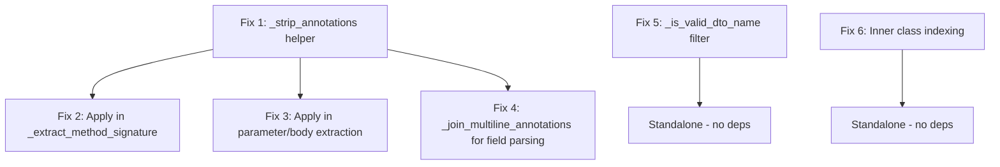

# DTO Class Resolution Bug Fixes — Implementation Plan

## Problem Summary

The backend Java extractor produces **garbage class names** in DTO type collection and **fails to resolve valid DTO classes** defined as inner classes. Five distinct bugs contribute to these symptoms.

---

## Bug Inventory

| ID | Bug | Location | Symptom |
|----|-----|----------|---------|
| B1 | `_extract_method_signature` captures annotation text as return type | L1045-1054 | Annotations like `@PreAuthorize(...)` and `@Hidden` in `post_window` are matched by the return-type regex, producing garbage type strings |
| B2 | Annotation stripping regex `[^)]*` does not handle nested parens or strings | L1189, L1251 | `@Schema(description = "Incident Id.", example = "...")` is partially stripped, leaving garbage text that becomes part of the type |
| B3 | `_extract_class_fields` uses line-based annotation collection | L3035-3041 | Multi-line annotations split across lines leak continuation text into field parsing |
| B4 | `_add_dto_type_names` regex is too permissive | L2915 | `r'[A-Z]\w+'` extracts ALL_CAPS constants, common English words, and annotation names from garbage type strings |
| A | `_build_class_index` only indexes by file stem | L2882-2897 | Inner classes like `SeatEvent` inside `SeatController.java` are never found |

---

## Fix 1: Shared `_strip_annotations` Helper

### Rationale

Bugs B1, B2, and B3 all stem from the same root cause: annotation text with nested parentheses and string literals is not properly handled. A single shared helper solves all three.

### Design

Add a **static method** `_strip_annotations(text: str) -> str` to [`BackendJavaExtractor`](src/cortex/extractors/backend_java.py:117) that removes all Java annotations from a text string, correctly handling:

1. **Balanced parentheses** — `@Foo(bar(baz))` must remove the entire annotation
2. **String literals** — `)` inside `"..."` must not close the annotation
3. **No-args annotations** — `@Hidden` with no parentheses
4. **Multi-line annotations** — `@Schema(\n  description = "..."\n)` spanning multiple lines

#### Algorithm

```
def _strip_annotations(text: str) -> str:
    result = []
    i = 0
    while i < len(text):
        if text[i] == '@' and (i == 0 or not text[i-1].isalnum()):
            # Start of annotation — consume @Name
            j = i + 1
            while j < len(text) and (text[j].isalnum() or text[j] == '_' or text[j] == '.'):
                j += 1
            # Check for parenthesized arguments
            k = j
            while k < len(text) and text[k] in ' \t\n\r':
                k += 1
            if k < len(text) and text[k] == '(':
                # Consume balanced parens, respecting string literals
                depth = 0
                in_string = False
                escape_next = False
                while k < len(text):
                    ch = text[k]
                    if escape_next:
                        escape_next = False
                    elif ch == '\\' and in_string:
                        escape_next = True
                    elif ch == '"' and not escape_next:
                        in_string = not in_string
                    elif not in_string:
                        if ch == '(':
                            depth += 1
                        elif ch == ')':
                            depth -= 1
                            if depth == 0:
                                k += 1
                                break
                    k += 1
                i = k
            else:
                i = j
            # Skip trailing whitespace after annotation
            while i < len(text) and text[i] in ' \t\n\r':
                i += 1
        else:
            result.append(text[i])
            i += 1
    return ''.join(result)
```

#### Key properties

- **O(n)** single-pass — no regex backtracking
- Handles `@Qualifier("name")`, `@Schema(description = "Incident Id.", example = "eyJ...")`, `@PreAuthorize("hasRole('ADMIN')")` correctly
- Preserves non-annotation text exactly
- Handles `@` inside string literals by checking the preceding character is not alphanumeric

### Placement

Add as a **static method** on [`BackendJavaExtractor`](src/cortex/extractors/backend_java.py:117), placed right before [`_extract_method_signature`](src/cortex/extractors/backend_java.py:1034) — around line 1034.

---

## Fix 2: Apply `_strip_annotations` in `_extract_method_signature` — Bug B1

### Current Code (L1034-1054)

```python
def _extract_method_signature(self, text: str) -> str | None:
    m = re.search(
        r'(?:(?:public|protected|private|default)\s+)?'
        r'(?:static\s+)?'
        r'(?:final\s+)?'
        r'(?:synchronized\s+)?'
        r'((?:[\w\.<>,\?\[\]\s]|(?:extends\s)|(?:super\s))+?)\s+'
        r'(\w+)\s*\(',
        text,
        re.DOTALL,
    )
```

### Problem

The `post_window` text passed to this method contains annotations like `@PreAuthorize("hasRole('ADMIN')")` and `@Hidden` before the actual method declaration. With `re.DOTALL`, the return-type capture group `((?:[\w\.<>,\?\[\]\s]|...)` matches across newlines and captures annotation text.

### Fix

Before running the regex, strip annotations from the input text. The method signature regex then only sees the clean method declaration.

```python
def _extract_method_signature(self, text: str) -> str | None:
    # Strip annotations to prevent them from being captured as return type
    clean_text = self._strip_annotations(text)
    # Also strip single-line comments
    clean_text = re.sub(r'//[^\n]*', '', clean_text)

    m = re.search(
        r'(?:(?:public|protected|private|default)\s+)?'
        r'(?:static\s+)?'
        r'(?:final\s+)?'
        r'(?:synchronized\s+)?'
        r'((?:[\w\.<>,\?\[\]\s]|(?:extends\s)|(?:super\s))+?)\s+'
        r'(\w+)\s*\(',
        clean_text,
        re.DOTALL,
    )
    if not m:
        return None

    paren_start = m.end() - 1
    # IMPORTANT: Find matching ')' in the ORIGINAL text, not clean_text,
    # because we need to preserve @RequestBody, @PathVariable etc. in the
    # parameter list. Map the paren position back to original text.
```

**Critical subtlety**: The parameter list inside `(...)` contains annotations like `@RequestBody` and `@PathVariable` that must be preserved. Two approaches:

**Option A — Strip annotations only from the pre-paren portion**: Split the text at the method's opening `(`, strip annotations only from the part before `(`, then re-attach the parameter list from the original text.

**Option B — Use clean_text only for regex matching, then map positions back to original text**: Use `clean_text` to find the method name and return type, but extract the full signature from the original `text` by searching for the method name + `(` in the original.

**Recommended: Option A** — simpler and less error-prone.

### Implementation Detail for Option A

```python
def _extract_method_signature(self, text: str) -> str | None:
    # Strip annotations from the text to find the method declaration cleanly.
    # We only strip for the purpose of finding the return type and method name.
    clean_text = self._strip_annotations(text)
    clean_text = re.sub(r'//[^\n]*', '', clean_text)

    m = re.search(
        r'(?:(?:public|protected|private|default)\s+)?'
        r'(?:static\s+)?(?:final\s+)?(?:synchronized\s+)?'
        r'((?:[\w\.<>,\?\[\]\s]|(?:extends\s)|(?:super\s))+?)\s+'
        r'(\w+)\s*\(',
        clean_text,
        re.DOTALL,
    )
    if not m:
        return None

    method_name = m.group(2)

    # Now find this method name in the ORIGINAL text to get the full signature
    # including parameter annotations
    orig_m = re.search(
        rf'\b{re.escape(method_name)}\s*\(',
        text,
    )
    if not orig_m:
        return None

    # Extract return type from clean_text
    return_type = m.group(1).strip()

    # Find matching ')' in original text from the opening '('
    paren_start = orig_m.end() - 1
    depth = 0
    for i in range(paren_start, len(text)):
        if text[i] == '(':
            depth += 1
        elif text[i] == ')':
            depth -= 1
            if depth == 0:
                # Build signature: return_type + method_name + params from original
                param_section = text[paren_start:i + 1]
                return f"{return_type} {method_name}{param_section}".strip()

    return None
```

### Files Modified

- [`src/cortex/extractors/backend_java.py`](src/cortex/extractors/backend_java.py) — [`_extract_method_signature`](src/cortex/extractors/backend_java.py:1034) method

---

## Fix 3: Replace `[^)]*` Annotation Stripping in Parameter/Body Extraction — Bug B2

### Current Code

In [`_extract_parameters_from_signature`](src/cortex/extractors/backend_java.py:1112) at L1189:
```python
remaining = re.sub(r'@\w+(?:\([^)]*\))?\s*', '', remaining).strip()
```

In [`_extract_request_body_from_signature`](src/cortex/extractors/backend_java.py:1218) at L1251:
```python
remaining = re.sub(r'@\w+(?:\([^)]*\))?\s*', '', remaining).strip()
```

### Problem

`[^)]*` stops at the first `)`, so `@Schema(description = "Incident Id.", example = "eyJ...")` becomes partially stripped, leaving `example = "eyJ...")` as garbage text that gets parsed as a type name.

### Fix

Replace both lines with a call to `self._strip_annotations(remaining)`:

```python
# L1189 — in _extract_parameters_from_signature
remaining = self._strip_annotations(remaining).strip()

# L1251 — in _extract_request_body_from_signature
remaining = self._strip_annotations(remaining).strip()
```

### Additional Fix in `_extract_request_body_from_signature`

The `@RequestBody` attribute extraction at L1241 also uses `[^)]*`:
```python
paren_m = re.match(r'\s*\(([^)]*)\)', rest)
```

This should also be fixed to handle nested parens. However, `@RequestBody` typically only has `required = false/true` as attributes, so the risk is lower. For consistency, replace with a balanced-paren extraction:

```python
# Instead of regex, use a helper to extract the balanced paren content
if rest.lstrip().startswith('('):
    # Find matching ')' respecting strings
    paren_content, end_pos = self._extract_balanced_paren_content(rest.lstrip())
    if paren_content is not None:
        # parse attributes from paren_content
        ...
        rest = rest.lstrip()[end_pos:]
```

Or, since `@RequestBody` attributes are simple, keep the regex but add a note. The critical fix is the `_strip_annotations` call on L1251.

### Similarly in `_extract_parameters_from_signature`

The `@RequestParam(...)` attribute extraction at L1159 also uses `[^)]*`:
```python
paren_m = re.match(r'\s*\(([^)]*)\)', rest_after_ann)
```

This is less risky because `@RequestParam` attributes are simple key-value pairs. But for robustness, consider the same balanced-paren approach. **Lower priority** — can be deferred.

### Files Modified

- [`src/cortex/extractors/backend_java.py`](src/cortex/extractors/backend_java.py) — [`_extract_parameters_from_signature`](src/cortex/extractors/backend_java.py:1112) L1189
- [`src/cortex/extractors/backend_java.py`](src/cortex/extractors/backend_java.py) — [`_extract_request_body_from_signature`](src/cortex/extractors/backend_java.py:1218) L1251

---

## Fix 4: Multi-line Annotation Handling in `_extract_class_fields` — Bug B3

### Current Code (L3030-3057)

```python
lines = class_body.split('\n')
pending_annotations: list[str] = []

for line in lines:
    stripped = line.strip()

    # Collect annotations
    if stripped.startswith('@'):
        pending_annotations.append(stripped)
        continue
```

### Problem

A multi-line annotation like:
```java
@Schema(
    description = "Incident Id.",
    example = "eyJpdiI6..."
)
private String incidentId;
```

Only the first line `@Schema(` is captured as an annotation. The continuation lines `description = "Incident Id.",` and `example = "eyJpdiI6..."` and `)` are processed as potential field declarations, producing garbage.

### Fix — Pre-process to Join Multi-line Annotations

Before splitting into lines, join multi-line annotations into single lines. Add a pre-processing step:

```python
def _join_multiline_annotations(self, text: str) -> str:
    """Join multi-line annotations into single lines.

    Scans for lines starting with '@' that have unbalanced parentheses,
    and joins subsequent lines until parentheses are balanced.
    """
    lines = text.split('\n')
    result: list[str] = []
    i = 0
    while i < len(lines):
        stripped = lines[i].strip()
        if stripped.startswith('@') and '(' in stripped:
            # Count parens — if unbalanced, join with next lines
            depth = 0
            in_string = False
            balanced = True
            for ch in stripped:
                if ch == '"' and not in_string:
                    in_string = True
                elif ch == '"' and in_string:
                    in_string = False
                elif not in_string:
                    if ch == '(':
                        depth += 1
                    elif ch == ')':
                        depth -= 1
            if depth > 0:
                # Unbalanced — join lines until balanced
                joined = [stripped]
                i += 1
                while i < len(lines) and depth > 0:
                    next_stripped = lines[i].strip()
                    joined.append(next_stripped)
                    in_string = False
                    for ch in next_stripped:
                        if ch == '"' and not in_string:
                            in_string = True
                        elif ch == '"' and in_string:
                            in_string = False
                        elif not in_string:
                            if ch == '(':
                                depth += 1
                            elif ch == ')':
                                depth -= 1
                    i += 1
                result.append(' '.join(joined))
            else:
                result.append(stripped)
                i += 1
        else:
            result.append(lines[i])  # preserve original indentation for non-annotation lines
            i += 1
    return '\n'.join(result)
```

Then in [`_extract_class_fields`](src/cortex/extractors/backend_java.py:3001):

```python
# Before splitting into lines, join multi-line annotations
class_body = self._join_multiline_annotations(class_body)
lines = class_body.split('\n')
```

### Alternative Approach

Instead of pre-processing, modify the line loop to track paren depth across lines when inside an annotation. This is more complex but avoids modifying the text. **The pre-processing approach is simpler and recommended.**

### Files Modified

- [`src/cortex/extractors/backend_java.py`](src/cortex/extractors/backend_java.py) — new method `_join_multiline_annotations`
- [`src/cortex/extractors/backend_java.py`](src/cortex/extractors/backend_java.py) — [`_extract_class_fields`](src/cortex/extractors/backend_java.py:3001) L3032

### Also Affected

The [`_extract_field_constraints`](src/cortex/extractors/backend_java.py:3145) method at L3153 uses `[^)]+` patterns:
```python
size_match = re.search(r'@Size\s*\(([^)]+)\)', a)
```

After Fix 4, annotations will be joined into single lines, so `[^)]+` will work correctly for simple annotations like `@Size(min=1, max=100)`. However, if `@Size` ever contains nested parens or strings, this would break. **Low risk — defer.**

---

## Fix 5: Validate DTO Type Names in `_add_dto_type_names` — Bug B4

### Current Code (L2910-2922)

```python
def _add_dto_type_names(self, type_str: str, names: set[str]) -> None:
    inner = re.findall(r'[A-Z]\w+', type_str)
    for name in inner:
        if name not in _PRIMITIVE_TYPES:
            names.add(name)
    base = type_str.split('<')[0].strip()
    if base and base[0].isupper() and base not in _PRIMITIVE_TYPES:
        names.add(base)
```

### Problem

The regex `r'[A-Z]\w+'` matches any uppercase-starting word, including:
- ALL_CAPS constants: `EXAMPLE_IDS`, `ACCESS_TOKEN`
- Common annotation names: `JsonProperty`, `Schema`, `NotNull`
- English words from annotation content: `Multiple`, `IDs`, `Access`, `Staff`
- Wrapper types already in `_RESPONSE_WRAPPERS`: `ResponseEntity`, `Mono`

### Fix — Add Validation Filters

```python
# New module-level constant
_KNOWN_ANNOTATION_NAMES = frozenset({
    "JsonProperty", "JsonIgnore", "JsonFormat", "JsonInclude",
    "JsonSerialize", "JsonDeserialize", "JsonCreator", "JsonValue",
    "JsonAlias", "JsonAnySetter", "JsonAnyGetter", "JsonManagedReference",
    "JsonBackReference", "JsonIdentityInfo", "JsonTypeInfo",
    "Schema", "ApiModel", "ApiModelProperty",
    "NotNull", "NotBlank", "NotEmpty", "NonNull", "Nullable",
    "Valid", "Validated",
    "Size", "Min", "Max", "Pattern", "Email", "Positive", "PositiveOrZero",
    "Negative", "NegativeOrZero", "Past", "Future", "PastOrPresent",
    "FutureOrPresent", "Digits", "DecimalMin", "DecimalMax",
    "RequestBody", "RequestParam", "PathVariable", "RequestHeader",
    "RequestMapping", "GetMapping", "PostMapping", "PutMapping",
    "DeleteMapping", "PatchMapping",
    "RestController", "Controller", "Service", "Repository", "Component",
    "Autowired", "Inject", "Value", "Bean", "Configuration",
    "PreAuthorize", "Secured", "RolesAllowed",
    "Override", "Deprecated", "SuppressWarnings",
    "Hidden", "Operation", "Tag", "ApiResponse", "ApiResponses",
    "Transactional", "Async", "Scheduled", "EventListener",
    "Builder", "Data", "Getter", "Setter", "AllArgsConstructor",
    "NoArgsConstructor", "RequiredArgsConstructor", "EqualsAndHashCode",
    "ToString", "Slf4j", "Log4j2",
    "Table", "Entity", "Column", "Id", "GeneratedValue",
    "ManyToOne", "OneToMany", "ManyToMany", "OneToOne",
    "JoinColumn", "Enumerated", "Temporal",
    "Qualifier", "Primary", "Lazy", "Scope",
    "CrossOrigin", "ExceptionHandler", "ControllerAdvice",
    "Multiple",  # common English word that appears in annotation content
})

def _add_dto_type_names(self, type_str: str, names: set[str]) -> None:
    """Extract concrete DTO type names from a type string, stripping generics."""
    inner = re.findall(r'[A-Z]\w+', type_str)
    for name in inner:
        if not self._is_valid_dto_name(name):
            continue
        names.add(name)
    # Also check the outer type itself
    base = type_str.split('<')[0].strip()
    if base and base[0].isupper() and self._is_valid_dto_name(base):
        names.add(base)

@staticmethod
def _is_valid_dto_name(name: str) -> bool:
    """Check if a name looks like a valid DTO class name."""
    # Reject primitives and standard types
    if name in _PRIMITIVE_TYPES:
        return False
    # Reject response wrapper types
    if name in _RESPONSE_WRAPPERS:
        return False
    # Reject known annotation names
    if name in _KNOWN_ANNOTATION_NAMES:
        return False
    # Reject ALL_CAPS names — these are constants, not class names
    # e.g., EXAMPLE_IDS, ACCESS_TOKEN
    if re.match(r'^[A-Z][A-Z0-9_]+$', name):
        return False
    # Reject very short names — 1-2 chars are likely generic type params
    # (T, E, K, V are already in _PRIMITIVE_TYPES, but catch others like ID)
    if len(name) <= 2:
        return False
    return True
```

### Files Modified

- [`src/cortex/extractors/backend_java.py`](src/cortex/extractors/backend_java.py) — new constant `_KNOWN_ANNOTATION_NAMES` near L98
- [`src/cortex/extractors/backend_java.py`](src/cortex/extractors/backend_java.py) — new static method `_is_valid_dto_name`
- [`src/cortex/extractors/backend_java.py`](src/cortex/extractors/backend_java.py) — [`_add_dto_type_names`](src/cortex/extractors/backend_java.py:2910) modified

---

## Fix 6: Index Inner Classes in `_build_class_index` — Issue A

### Current Code (L2882-2897)

```python
def _build_class_index(self, root: Path) -> dict[str, Path]:
    index: dict[str, Path] = {}
    for ext in ("*.java", "*.kt"):
        for f in root.rglob(ext):
            if any(part in _EXCLUDED_DIRS for part in f.parts):
                continue
            if any(part in _TEST_DIR_SEGMENTS for part in f.parts):
                continue
            class_name = f.stem
            if class_name not in index:
                index[class_name] = f
    return index
```

### Problem

Only indexes by filename stem. A class `SeatEvent` defined inside `SeatController.java` will not be indexed because `SeatController.java`'s stem is `SeatController`, not `SeatEvent`.

### Fix — Scan File Contents for Inner/Additional Class Declarations

After the initial file-stem pass, do a second pass scanning file contents for additional class/enum/record/interface declarations:

```python
def _build_class_index(self, root: Path) -> dict[str, Path]:
    index: dict[str, Path] = {}
    all_files: list[Path] = []

    for ext in ("*.java", "*.kt"):
        for f in root.rglob(ext):
            if any(part in _EXCLUDED_DIRS for part in f.parts):
                continue
            if any(part in _TEST_DIR_SEGMENTS for part in f.parts):
                continue
            all_files.append(f)
            # Primary index: filename stem
            class_name = f.stem
            if class_name not in index:
                index[class_name] = f

    # Second pass: scan for inner/additional class declarations
    # Only scan files that might contain inner classes (heuristic: files with
    # multiple class/enum/record/interface declarations)
    inner_class_re = re.compile(
        r'\b(?:class|enum|record|interface)\s+(\w+)\b'
    )
    for f in all_files:
        try:
            content = f.read_text(errors="replace")
        except Exception:
            continue
        for m in inner_class_re.finditer(content):
            name = m.group(1)
            if name not in index and name != f.stem:
                index[name] = f

    return index
```

### Performance Consideration

This reads every Java/Kotlin file twice — once for the stem index, once for inner classes. The file content is already read later during DTO parsing, so this adds one extra read per file. For typical repos with hundreds of files, this is negligible. If performance becomes a concern, the content could be cached, but that is premature optimization.

### Alternative: Lazy Inner Class Resolution

Instead of scanning all files upfront, add a fallback in [`_resolve_dto_types`](src/cortex/extractors/backend_java.py:2838): when `class_index.get(name)` returns `None`, do a targeted `grep` for `class {name}` across all Java files. This avoids reading all files upfront but is slower per miss. **The upfront scan is simpler and recommended.**

### Files Modified

- [`src/cortex/extractors/backend_java.py`](src/cortex/extractors/backend_java.py) — [`_build_class_index`](src/cortex/extractors/backend_java.py:2882) method

---

## Implementation Order

The fixes should be implemented in this order due to dependencies:



Recommended sequence:

1. **Fix 1** — `_strip_annotations` helper — foundation for Fixes 2, 3, 4
2. **Fix 5** — `_is_valid_dto_name` filter — standalone, quick win
3. **Fix 6** — Inner class indexing — standalone, quick win
4. **Fix 2** — Apply `_strip_annotations` in `_extract_method_signature`
5. **Fix 3** — Apply `_strip_annotations` in parameter/body extraction
6. **Fix 4** — `_join_multiline_annotations` for field parsing

---

## Test Plan

### New Unit Tests for `_strip_annotations`

Add to `TestMethodSignatureExtraction` class in [`tests/test_backend_java_extractor.py`](tests/test_backend_java_extractor.py):

| Test | Input | Expected Output |
|------|-------|-----------------|
| `test_strip_simple_annotation` | `@Hidden public void foo()` | `public void foo()` |
| `test_strip_annotation_with_args` | `@Operation(summary = "Get") public void foo()` | `public void foo()` |
| `test_strip_annotation_with_nested_parens` | `@PreAuthorize("hasRole('ADMIN')") public void foo()` | `public void foo()` |
| `test_strip_annotation_with_multiline_string` | `@Schema(\n  description = "Incident Id.",\n  example = "eyJ..."\n) String field` | `String field` |
| `test_strip_multiple_annotations` | `@Hidden @Deprecated public void foo()` | `public void foo()` |
| `test_strip_preserves_non_annotation_text` | `public ResponseEntity<OrderDto> getOrder()` | unchanged |
| `test_strip_annotation_with_escaped_quotes` | `@Value("say \"hello\"") String x` | `String x` |

### New Unit Tests for Bug B1 Fix

| Test | Input to `_extract_method_signature` | Assertion |
|------|--------------------------------------|-----------|
| `test_signature_with_preauthorize_annotation` | `@PreAuthorize("hasRole('ADMIN')")\n@Hidden\npublic ResponseEntity<OrderDto> getOrder(@PathVariable String id)` | Return type is `ResponseEntity<OrderDto>`, not annotation garbage |
| `test_signature_with_schema_annotation` | `@Schema(description = "...")\npublic List<String> getItems()` | Return type is `List<String>` |

### New Unit Tests for Bug B2 Fix

| Test | Input to `_extract_parameters_from_signature` | Assertion |
|------|-----------------------------------------------|-----------|
| `test_param_with_complex_schema_annotation` | `void foo(@Schema(description = "Incident Id.", example = "eyJ...") @RequestParam String incidentId)` | Extracts `incidentId` with type `String`, no garbage |
| `test_body_with_complex_schema_annotation` | `void foo(@Schema(description = "Request body") @Valid @RequestBody CreateRequest req)` | Extracts `CreateRequest` as body type |

### New Unit Tests for Bug B3 Fix

| Test | Input to `_extract_class_fields` | Assertion |
|------|----------------------------------|-----------|
| `test_multiline_schema_annotation_on_field` | Class with `@Schema(\n  description = "..."\n)\nprivate String name;` | Extracts field `name` with type `String` and description |
| `test_multiline_jsonproperty_annotation` | Class with `@JsonProperty(\n  value = "custom_name"\n)\nprivate String name;` | Extracts field with `json_name = "custom_name"` |

### New Unit Tests for Bug B4 Fix

| Test | Input to `_add_dto_type_names` | Assertion |
|------|-------------------------------|-----------|
| `test_rejects_all_caps_constant` | `"EXAMPLE_IDS"` | Not added to names set |
| `test_rejects_known_annotation_name` | `"JsonProperty"` | Not added to names set |
| `test_rejects_response_wrapper` | `"ResponseEntity"` | Not added to names set |
| `test_accepts_valid_dto_name` | `"OrderDto"` | Added to names set |
| `test_rejects_short_name` | `"ID"` | Not added to names set |
| `test_is_valid_dto_name_accepts_pascal_case` | `"SeatEvent"` | Returns `True` |

### New Unit Tests for Issue A Fix

| Test | Setup | Assertion |
|------|-------|-----------|
| `test_build_class_index_finds_inner_class` | Create `SeatController.java` containing `public class SeatEvent { ... }` inside | `class_index["SeatEvent"]` points to `SeatController.java` |
| `test_build_class_index_inner_class_no_override` | Create `SeatEvent.java` AND `SeatController.java` with inner `SeatEvent` | `class_index["SeatEvent"]` points to `SeatEvent.java` — file-stem takes priority |

### Regression Tests

All existing tests must continue to pass. Key tests to verify:

- [`test_extract_signature_with_annotations_before`](tests/test_backend_java_extractor.py:2985)
- [`test_extract_signature_interface_method`](tests/test_backend_java_extractor.py:2998)
- [`test_extract_signature_multiline`](tests/test_backend_java_extractor.py:3007)
- [`test_extract_path_variable`](tests/test_backend_java_extractor.py:3037)
- [`test_extract_request_param_with_attributes`](tests/test_backend_java_extractor.py:3045)
- [`test_extract_class_fields_basic`](tests/test_backend_java_extractor.py:3356)
- [`test_extract_class_fields_with_annotations`](tests/test_backend_java_extractor.py:3371)
- [`test_collect_dto_type_names`](tests/test_backend_java_extractor.py:3500)
- [`test_extract_dto_schemas_integration`](tests/test_backend_java_extractor.py:3595)
- [`test_transitive_dto_resolution`](tests/test_backend_java_extractor.py:3764)

### Integration Smoke Test

```bash
uv run cortex run-local --config config/repos-fixtures.yaml --output-dir /tmp/cortex-smoke
```

Verify the output `manifest.json` files do not contain garbage DTO names.

---

## Summary of Files Modified

| File | Changes |
|------|---------|
| [`src/cortex/extractors/backend_java.py`](src/cortex/extractors/backend_java.py) | Add `_strip_annotations` static method, add `_join_multiline_annotations` method, add `_is_valid_dto_name` static method, add `_KNOWN_ANNOTATION_NAMES` constant, modify `_extract_method_signature`, modify `_extract_parameters_from_signature` L1189, modify `_extract_request_body_from_signature` L1251, modify `_extract_class_fields` L3032, modify `_add_dto_type_names`, modify `_build_class_index` |
| [`tests/test_backend_java_extractor.py`](tests/test_backend_java_extractor.py) | Add ~20 new unit tests across existing test classes |

No schema changes. No new files. No changes to other extractors or the MCP server.

---

## Execution Checklist

- [ ] Implement `_strip_annotations` static method on `BackendJavaExtractor`
- [ ] Write unit tests for `_strip_annotations`
- [ ] Implement `_is_valid_dto_name` static method and `_KNOWN_ANNOTATION_NAMES` constant
- [ ] Write unit tests for `_is_valid_dto_name`
- [ ] Modify `_build_class_index` to scan for inner class declarations
- [ ] Write unit tests for inner class indexing
- [ ] Modify `_extract_method_signature` to use `_strip_annotations`
- [ ] Write unit tests for B1 fix
- [ ] Replace `[^)]*` annotation stripping in `_extract_parameters_from_signature` with `_strip_annotations`
- [ ] Replace `[^)]*` annotation stripping in `_extract_request_body_from_signature` with `_strip_annotations`
- [ ] Write unit tests for B2 fix
- [ ] Implement `_join_multiline_annotations` method
- [ ] Modify `_extract_class_fields` to pre-process with `_join_multiline_annotations`
- [ ] Write unit tests for B3 fix
- [ ] Run full test suite: `uv run pytest tests/ mcp_server/tests/ -v`
- [ ] Run smoke test: `uv run cortex run-local --config config/repos-fixtures.yaml --output-dir /tmp/cortex-smoke`
- [ ] Run linter: `uv run ruff check src/ tests/ mcp_server/`
