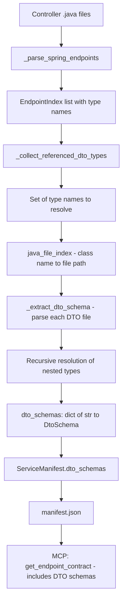

# DTO Schema Extraction Plan

## Overview

Extend the Backend Java (Spring Boot) extractor to extract **DTO class definitions** — fields, types, validation annotations, and nested references — from Java source files. This builds on the existing endpoint parameter/body/response extraction (which currently captures only type *names*) to provide full structural schemas, similar to what OpenAPI/Swagger `components/schemas` provides.

### Current State

The extractor already captures type names in [`EndpointRequestBody`](src/cortex/schema.py:121) and [`EndpointResponse`](src/cortex/schema.py:128):

```json
{
  "request_body": { "type": "CreateOrderRequest", "required": true },
  "response": { "type": "OrderDto", "wrapper": "ResponseEntity" }
}
```

### Target State

After this feature, the manifest will also include the full DTO definitions:

```json
{
  "request_body": { "type": "CreateOrderRequest", "required": true },
  "response": { "type": "OrderDto", "wrapper": "ResponseEntity" },
  "dto_schemas": {
    "CreateOrderRequest": {
      "kind": "class",
      "fields": [
        { "name": "itemId", "type": "String", "required": true },
        { "name": "quantity", "type": "int", "required": false },
        { "name": "shippingAddress", "type": "AddressDto", "required": false }
      ]
    },
    "OrderDto": {
      "kind": "class",
      "fields": [
        { "name": "id", "type": "String", "required": false },
        { "name": "status", "type": "OrderStatus", "required": false },
        { "name": "items", "type": "List<OrderItemDto>", "required": false }
      ]
    },
    "AddressDto": { "kind": "class", "fields": [ ... ] },
    "OrderStatus": { "kind": "enum", "values": ["PENDING", "CONFIRMED", "SHIPPED", "DELIVERED"] },
    "OrderItemDto": { "kind": "class", "fields": [ ... ] }
  }
}
```

---

## Data Flow Diagram



---

## 1. Schema Design

### 1.1 New Pydantic Models in [`schema.py`](src/cortex/schema.py)

Add two new models after [`EndpointResponse`](src/cortex/schema.py:128) and before [`EndpointIndex`](src/cortex/schema.py:135):

```python
class DtoFieldConstraint(BaseModel):
    """Validation constraint extracted from Java Bean Validation annotations."""
    kind: str  # "size", "pattern", "min", "max", "email", "url"
    value: str | None = None  # e.g., "100" for @Max(100), "^[a-z]+$" for @Pattern
    min: str | None = None  # for @Size(min=1)
    max: str | None = None  # for @Size(max=100)


class DtoField(BaseModel):
    """A single field in a DTO class definition."""
    name: str  # field name (or @JsonProperty override)
    type: str  # Java type as string: "String", "List<OrderDto>", "int"
    required: bool = False  # true if @NotNull, @NotBlank, @NotEmpty present
    constraints: list[DtoFieldConstraint] = Field(default_factory=list)
    description: str | None = None  # from @Schema(description=...) if present


class DtoSchema(BaseModel):
    """Schema definition for a DTO class, record, or enum."""
    kind: str  # "class", "record", "enum", "interface"
    fields: list[DtoField] = Field(default_factory=list)  # empty for enums
    values: list[str] = Field(default_factory=list)  # non-empty only for enums
    extends: str | None = None  # parent class name if inheritance detected
```

### 1.2 Storage Location: Top-Level Map on [`ServiceManifest`](src/cortex/schema.py:179)

**Decision: Top-level `dto_schemas` map on `ServiceManifest`.**

Add to [`ServiceManifest`](src/cortex/schema.py:179):

```python
class ServiceManifest(BaseModel):
    # ... existing fields ...
    
    # DTO schema definitions referenced by endpoints
    dto_schemas: dict[str, DtoSchema] = Field(
        default_factory=dict,
        description=(
            "DTO class/record/enum schemas extracted from source code. "
            "Keys are simple class names (e.g., 'OrderDto'). "
            "Only includes types referenced by endpoint request/response types."
        ),
    )
```

**Rationale:**

| Option | Pros | Cons |
|--------|------|------|
| Top-level map only | Deduplication built-in; single source of truth; easy to look up by name | Requires cross-referencing from endpoint to map |
| Inline in EndpointRequestBody/Response | Self-contained per endpoint | Duplicates schemas shared across endpoints |
| Both (reference + definition) | Best of both worlds | Over-engineered for deterministic parsing |

The top-level map approach is the simplest and avoids duplication. The MCP tool can resolve type names from `request_body.type` / `response.type` against the `dto_schemas` map.

### 1.3 Handling Nested DTOs

When a DTO field references another DTO type (e.g., `AddressDto`), the extractor recursively resolves and includes that type in the `dto_schemas` map. This creates a flat map where all referenced types are top-level entries:

```json
{
  "dto_schemas": {
    "CreateOrderRequest": {
      "kind": "class",
      "fields": [
        { "name": "shippingAddress", "type": "AddressDto", "required": false }
      ]
    },
    "AddressDto": {
      "kind": "class",
      "fields": [
        { "name": "street", "type": "String", "required": true },
        { "name": "city", "type": "String", "required": true }
      ]
    }
  }
}
```

**Recursion depth limit: 5 levels.** This prevents runaway resolution while covering realistic DTO hierarchies. A `_seen` set prevents infinite loops from circular references (A → B → A).

### 1.4 Handling Generic Types

Generic types are preserved as-is in the `type` field string. The inner type parameter is extracted for recursive resolution:

| Java Type | `type` field value | Resolved inner types |
|-----------|-------------------|---------------------|
| `String` | `"String"` | None (primitive/standard) |
| `List<OrderDto>` | `"List<OrderDto>"` | `OrderDto` |
| `Map<String, Object>` | `"Map<String, Object>"` | None (standard types) |
| `Page<OrderDto>` | `"Page<OrderDto>"` | `OrderDto` |
| `Set<Long>` | `"Set<Long>"` | None (standard type) |
| `Map<String, AddressDto>` | `"Map<String, AddressDto>"` | `AddressDto` |

A set of **skip types** (Java standard library + primitives) prevents attempting to resolve `String`, `Integer`, `Long`, `Object`, `BigDecimal`, etc.

---

## 2. Extraction Strategy

### 2.1 Overall Algorithm

The DTO extraction runs as a post-processing step after endpoint extraction, within the [`extract()`](src/cortex/extractors/backend_java.py:103) method:

```
1. Extract endpoints (existing logic) → list of EndpointIndex
2. Collect all type names from request_body.type and response.type across all endpoints
3. Extract inner types from generics (List<X> → X, Map<K,V> → K, V)
4. Filter out Java standard types (String, Integer, List, Map, etc.)
5. Build class-name → file-path index (reuse existing java_file_index)
6. For each referenced type name:
   a. Find the .java/.kt file containing that class/record/enum
   b. Parse the class definition to extract fields
   c. For each field, check if its type is another DTO → add to resolution queue
7. Repeat until queue is empty or depth limit reached
8. Return dict[str, DtoSchema]
```

### 2.2 Java Patterns to Parse

#### 2.2.1 Simple POJO with Fields

```java
public class OrderDto {
    private String id;
    private String customerName;
    private BigDecimal amount;
    private List<OrderItemDto> items;
}
```

**Regex strategy:** Match `private|protected|public` + type + field name + `;`

```python
FIELD_PATTERN = re.compile(
    r'(?:private|protected|public)\s+'
    r'(?:static\s+)?'        # skip static fields
    r'(?:final\s+)?'         # allow final fields
    r'([\w<>,\s\?\[\]]+?)\s+'  # type (with generics)
    r'(\w+)\s*[;=]',         # field name, terminated by ; or =
    re.MULTILINE,
)
```

Static fields should be **excluded** (they are class-level constants, not DTO fields).

#### 2.2.2 Lombok Classes

```java
@Data
public class CreateOrderRequest {
    @NotNull
    private String itemId;
    private int quantity;
    @Valid
    private AddressDto shippingAddress;
}
```

Lombok `@Data`, `@Value`, `@Builder`, `@Getter` classes are parsed identically to POJOs — the fields are the schema. The Lombok annotations themselves don't change the field structure; they just generate boilerplate. No special handling needed beyond detecting that the class uses Lombok (which we can note but don't need to act on).

#### 2.2.3 Java Records

```java
public record OrderDto(String id, String name, BigDecimal amount) {}
```

**Regex strategy:** Match `record ClassName(params)` and parse the parameter list:

```python
RECORD_PATTERN = re.compile(
    r'(?:public\s+)?record\s+(\w+)\s*\(([^)]*)\)',
    re.DOTALL,
)
```

Record components are parsed like method parameters — split by comma, extract type + name.

#### 2.2.4 Kotlin Data Classes

```kotlin
data class OrderDto(
    val id: String,
    val name: String,
    val amount: BigDecimal
)
```

**Regex strategy:** Match `data class ClassName(params)`:

```python
KOTLIN_DATA_CLASS_PATTERN = re.compile(
    r'data\s+class\s+(\w+)\s*\(([^)]*)\)',
    re.DOTALL,
)
```

Kotlin field parsing differs: `val name: Type` instead of `Type name`. Handle both `val` and `var`.

#### 2.2.5 Inheritance

```java
public class CreateOrderRequest extends BaseRequest {
    private String itemId;
}
```

**Strategy:** Extract the `extends` clause and store it in `DtoSchema.extends`. Do NOT attempt to merge parent fields — that would require resolving the parent class, which may be in a different module or external library. The `extends` field gives consumers enough context.

**Regex:**

```python
EXTENDS_PATTERN = re.compile(
    r'class\s+\w+\s+extends\s+(\w+)',
)
```

If the parent class is found in the repo, it IS included in `dto_schemas` (resolved like any other referenced type).

#### 2.2.6 Enums

```java
public enum OrderStatus {
    PENDING, CONFIRMED, SHIPPED, DELIVERED, CANCELLED;
}
```

**Strategy:** Detect `enum` keyword, extract constant names (uppercase identifiers before any `(` or `{` or `;`):

```python
ENUM_PATTERN = re.compile(
    r'(?:public\s+)?enum\s+(\w+)\s*(?:implements\s+[\w<>,\s]+)?\s*\{([^}]*)\}',
    re.DOTALL,
)
```

Parse enum values by splitting on commas, stopping at the first `(` or `;` per value (to handle enums with constructors).

#### 2.2.7 Inner Classes

```java
public class OrderResponse {
    private String id;
    
    public static class OrderItem {
        private String productId;
        private int quantity;
    }
}
```

**Strategy:** If a referenced type name matches an inner class (detected by `OuterClass.InnerClass` or by finding the class definition nested inside another class), extract it. For the initial implementation, focus on top-level classes only. Inner class support can be added as a follow-up if needed.

### 2.3 Annotations to Extract

#### 2.3.1 Required-ness Annotations → `required: true`

| Annotation | Effect |
|-----------|--------|
| `@NotNull` | `required: true` |
| `@NotBlank` | `required: true` |
| `@NotEmpty` | `required: true` |
| `@NonNull` (Lombok) | `required: true` |

**Regex:** Look for these annotations in the line(s) immediately preceding the field declaration.

```python
REQUIRED_ANNOTATIONS = re.compile(
    r'@(?:NotNull|NotBlank|NotEmpty|NonNull)\b'
)
```

#### 2.3.2 JSON Annotations → Field Name Override / Skip

| Annotation | Effect |
|-----------|--------|
| `@JsonProperty("custom_name")` | Use `"custom_name"` as field name |
| `@JsonIgnore` | Skip this field entirely |
| `@JsonIgnoreProperties(...)` | Class-level; skip listed fields |

**Regex for `@JsonProperty`:**

```python
JSON_PROPERTY_PATTERN = re.compile(
    r'@JsonProperty\s*\(\s*(?:value\s*=\s*)?["\']([^"\']+)["\']\s*\)'
)
```

#### 2.3.3 Validation Constraints → `constraints` list

| Annotation | `DtoFieldConstraint` |
|-----------|---------------------|
| `@Size(min=1, max=100)` | `{"kind": "size", "min": "1", "max": "100"}` |
| `@Pattern(regexp="^[a-z]+$")` | `{"kind": "pattern", "value": "^[a-z]+$"}` |
| `@Min(0)` | `{"kind": "min", "value": "0"}` |
| `@Max(1000)` | `{"kind": "max", "value": "1000"}` |
| `@Email` | `{"kind": "email"}` |
| `@URL` | `{"kind": "url"}` |

These are extracted as structured constraint objects rather than free-text, enabling downstream tooling to use them programmatically.

#### 2.3.4 OpenAPI Schema Annotation → Description

```java
@Schema(description = "Customer email address")
private String email;
```

Extract `description` from `@Schema(description=...)` if present.

### 2.4 Finding DTO Classes Efficiently

#### 2.4.1 Reuse the Existing File Index

The [`_parse_spring_endpoints()`](src/cortex/extractors/backend_java.py:524) method already builds a `java_file_index: dict[str, list[Path]]` mapping file stems to paths. This index is built by iterating `root.rglob("*.java")` once. We extend this to also cover `.kt` files and make it available to the DTO extraction phase.

**Change:** Promote `java_file_index` from a local variable in `_parse_spring_endpoints` to an instance-level cache built once during `extract()`, so both endpoint extraction and DTO extraction can use it.

```python
def extract(self, repo_path: Path, service_yaml: ServiceYaml) -> ServiceManifest:
    effective_root = ...
    
    # Build file index once, reuse for endpoints + DTOs
    self._file_index = self._build_file_index(effective_root)
    
    # ... existing extraction ...
    api_contracts = self.find_api_contracts(effective_root)
    
    # NEW: Extract DTO schemas
    dto_schemas = self._extract_dto_schemas(effective_root, api_contracts)
    
    return ServiceManifest(..., dto_schemas=dto_schemas)
```

#### 2.4.2 File Index Structure

```python
def _build_file_index(self, root: Path) -> dict[str, list[Path]]:
    """Build class-name → file-path index for .java and .kt files."""
    index: dict[str, list[Path]] = {}
    for ext in ("*.java", "*.kt"):
        for f in root.rglob(ext):
            if any(part in _EXCLUDED_DIRS for part in f.parts):
                continue
            if any(part in _TEST_DIR_SEGMENTS for part in f.parts):
                continue
            index.setdefault(f.stem, []).append(f)
    return index
```

#### 2.4.3 Resolving a Type Name to a File

Given a type name like `OrderDto`:
1. Look up `OrderDto` in `_file_index` → get list of candidate files
2. If exactly one match → use it
3. If multiple matches → read each file, check if it contains `class OrderDto` or `record OrderDto` or `enum OrderDto` → use the first match
4. If no match → the type is external (from a dependency); record it as an unresolved reference

### 2.5 Skip Types (Java Standard Library)

These types should NOT be resolved as DTOs:

```python
_JAVA_STANDARD_TYPES = frozenset({
    # Primitives and wrappers
    "void", "boolean", "byte", "char", "short", "int", "long", "float", "double",
    "Boolean", "Byte", "Character", "Short", "Integer", "Long", "Float", "Double",
    "Void",
    # Common types
    "String", "Object", "BigDecimal", "BigInteger",
    "Date", "LocalDate", "LocalDateTime", "LocalTime", "Instant",
    "ZonedDateTime", "OffsetDateTime", "Duration", "Period",
    "UUID", "URI", "URL",
    # Collections (the container itself, not the type parameter)
    "List", "Set", "Map", "Collection", "Iterable",
    "ArrayList", "HashSet", "HashMap", "LinkedList", "TreeMap", "TreeSet",
    # Other common types
    "Optional", "Stream",
    "JsonNode", "ObjectNode", "ArrayNode",
    "MultipartFile",
    "byte[]", "Byte[]",
    # Spring/framework types
    "ResponseEntity", "Mono", "Flux", "Page", "Pageable", "Sort",
    "HttpServletRequest", "HttpServletResponse",
    # Kotlin types
    "Any", "Unit", "Nothing",
})
```

---

## 3. Performance Considerations

### 3.1 File Discovery

- The file index is built with a single `rglob` pass (already done for endpoint extraction)
- No additional filesystem traversal needed for DTO resolution
- Index is `O(n)` where n = number of source files; lookup is `O(1)` by class name

### 3.2 File Reading

- Each DTO file is read at most once (track resolved types in a `_seen` set)
- Typical repos have 10-50 DTO types referenced by endpoints; reading 50 files is negligible

### 3.3 Recursion Depth

- **Max depth: 5 levels** — covers realistic DTO hierarchies
- **Circular reference protection:** `_seen: set[str]` tracks already-resolved type names
- If a type is in `_seen`, skip it (already in the output map)

### 3.4 Bounded Output Size

- Only DTOs referenced (directly or transitively) by endpoint request/response types are extracted
- This naturally limits the output to the API surface area, not the entire codebase
- Enum values are capped at 50 entries to prevent bloat from large enums

---

## 4. Edge Cases

| Edge Case | Handling |
|-----------|----------|
| DTO class not found in repo (external dependency) | Skip silently; type name still appears in `request_body.type` / `response.type` |
| Abstract class as DTO type | Extract fields normally; set `kind: "class"` (abstract is still a class) |
| Interface as DTO type | Extract method signatures as pseudo-fields if they follow getter convention; set `kind: "interface"` |
| Inner/nested classes | Phase 1: skip. Phase 2: support `OuterClass.InnerClass` resolution |
| Enum with constructor args | Extract only the constant names, ignore constructor parameters |
| Primitive types | In `_JAVA_STANDARD_TYPES` skip set; never resolved |
| Wildcard generics `? extends Foo` | Preserve as-is in type string; resolve `Foo` if it's a DTO |
| Multiple classes in one file | Parse all class/record/enum definitions; match by name |
| `@JsonIgnore` on field | Exclude field from `DtoSchema.fields` |
| `@JsonIgnoreProperties` on class | Exclude listed field names |
| Lombok `@Builder.Default` | Treat as a regular field (default value doesn't affect schema structure) |
| Static fields | Exclude (not part of DTO serialization) |
| Transient fields | Exclude (not serialized) |
| Fields with `@JsonIgnore` | Exclude |
| Kotlin `val` vs `var` | Both are included as fields |
| Kotlin nullable types `String?` | Preserve `?` in type string; `required: false` |

---

## 5. Output Format

### 5.1 Full Manifest Example (relevant section)

```json
{
  "name": "order-service",
  "type": "backend-java",
  "api_contracts": [
    {
      "kind": "spring-annotations",
      "endpoints": [
        {
          "method": "POST",
          "path": "/v1/orders",
          "summary": "Create a new order",
          "request_body": { "type": "CreateOrderRequest", "required": true },
          "response": { "type": "OrderDto", "wrapper": "ResponseEntity" }
        }
      ]
    }
  ],
  "dto_schemas": {
    "CreateOrderRequest": {
      "kind": "class",
      "fields": [
        { "name": "itemId", "type": "String", "required": true, "constraints": [] },
        {
          "name": "quantity",
          "type": "int",
          "required": false,
          "constraints": [
            { "kind": "min", "value": "1" },
            { "kind": "max", "value": "999" }
          ]
        },
        {
          "name": "email",
          "type": "String",
          "required": true,
          "constraints": [
            { "kind": "email" },
            { "kind": "size", "max": "255" }
          ]
        },
        { "name": "shippingAddress", "type": "AddressDto", "required": false, "constraints": [] }
      ],
      "values": [],
      "extends": null
    },
    "OrderDto": {
      "kind": "record",
      "fields": [
        { "name": "id", "type": "String", "required": false, "constraints": [] },
        { "name": "status", "type": "OrderStatus", "required": false, "constraints": [] },
        { "name": "items", "type": "List<OrderItemDto>", "required": false, "constraints": [] },
        { "name": "createdAt", "type": "Instant", "required": false, "constraints": [] }
      ],
      "values": [],
      "extends": null
    },
    "AddressDto": {
      "kind": "class",
      "fields": [
        { "name": "street", "type": "String", "required": true, "constraints": [] },
        { "name": "city", "type": "String", "required": true, "constraints": [] },
        { "name": "state", "type": "String", "required": false, "constraints": [{ "kind": "size", "max": "2" }] },
        { "name": "zipCode", "type": "String", "required": false, "constraints": [{ "kind": "pattern", "value": "^\\d{5}$" }] }
      ],
      "values": [],
      "extends": null
    },
    "OrderStatus": {
      "kind": "enum",
      "fields": [],
      "values": ["PENDING", "CONFIRMED", "SHIPPED", "DELIVERED", "CANCELLED"],
      "extends": null
    },
    "OrderItemDto": {
      "kind": "class",
      "fields": [
        { "name": "productId", "type": "String", "required": true, "constraints": [] },
        { "name": "quantity", "type": "int", "required": false, "constraints": [] },
        { "name": "unitPrice", "type": "BigDecimal", "required": false, "constraints": [] }
      ],
      "values": [],
      "extends": null
    }
  }
}
```

### 5.2 MCP Tool Enhancement

The [`get_endpoint_contract`](mcp_server/server.py:411) tool response will be enriched to include resolved DTO schemas:

```json
{
  "service": "order-service",
  "method": "POST",
  "path": "/v1/orders",
  "parameters": [],
  "request_body": { "type": "CreateOrderRequest", "required": true },
  "response": { "type": "OrderDto", "wrapper": "ResponseEntity" },
  "schemas": {
    "CreateOrderRequest": { "kind": "class", "fields": [...] },
    "OrderDto": { "kind": "record", "fields": [...] },
    "AddressDto": { "kind": "class", "fields": [...] },
    "OrderStatus": { "kind": "enum", "values": [...] }
  },
  "message": "Endpoint contract extracted from source code."
}
```

The MCP tool resolves schemas by:
1. Getting `request_body.type` and `response.type` from the endpoint
2. Looking up those type names in `manifest.dto_schemas`
3. Recursively including any types referenced by fields of those DTOs
4. Returning the relevant subset as `schemas` in the response

---

## 6. Implementation Steps

### Step 1: Add Pydantic Models to [`schema.py`](src/cortex/schema.py)

**File:** [`src/cortex/schema.py`](src/cortex/schema.py)

- Add `DtoFieldConstraint`, `DtoField`, `DtoSchema` models
- Add `dto_schemas: dict[str, DtoSchema]` field to [`ServiceManifest`](src/cortex/schema.py:179)

### Step 2: Update JSON Schema [`manifest.schema.json`](schemas/manifest.schema.json)

**File:** [`schemas/manifest.schema.json`](schemas/manifest.schema.json)

- Add `dto_schemas` property with nested object definitions for `DtoFieldConstraint`, `DtoField`, `DtoSchema`
- Must stay in sync with Pydantic models

### Step 3: Implement File Index Builder

**File:** [`src/cortex/extractors/backend_java.py`](src/cortex/extractors/backend_java.py)

- Add `_build_file_index()` method that builds `dict[str, list[Path]]` for `.java` and `.kt` files
- Refactor [`_parse_spring_endpoints()`](src/cortex/extractors/backend_java.py:524) to use the shared index instead of building its own local `java_file_index`

### Step 4: Implement Type Name Collection

**File:** [`src/cortex/extractors/backend_java.py`](src/cortex/extractors/backend_java.py)

- Add `_collect_referenced_dto_types()` method
- Walks all endpoints in `api_contracts`, collects `request_body.type` and `response.type`
- Also collects types from `outbound_calls[].endpoints[].request_body.type` and `.response.type`
- Extracts inner types from generics (`List<X>` → `X`)
- Filters out `_JAVA_STANDARD_TYPES`
- Returns `set[str]` of type names to resolve

### Step 5: Implement DTO Class Parser

**File:** [`src/cortex/extractors/backend_java.py`](src/cortex/extractors/backend_java.py)

- Add `_parse_dto_from_java()` method — parses a single Java file for a given class name
- Handles: POJO fields, records, enums, Lombok classes
- Extracts: field names, types, `@NotNull`/`@NotBlank`/`@NotEmpty` → required, `@JsonProperty` → name override, `@JsonIgnore` → skip, validation constraints
- Returns `DtoSchema | None`

- Add `_parse_dto_from_kotlin()` method — parses a single Kotlin file for a given class name
- Handles: data classes, enums
- Returns `DtoSchema | None`

### Step 6: Implement Recursive DTO Resolution

**File:** [`src/cortex/extractors/backend_java.py`](src/cortex/extractors/backend_java.py)

- Add `_extract_dto_schemas()` orchestrator method
- Takes `root: Path` and `api_contracts: list[ApiContract]`
- Calls `_collect_referenced_dto_types()` to get initial set
- Iteratively resolves each type using `_parse_dto_from_java()` / `_parse_dto_from_kotlin()`
- For each resolved DTO, scans fields for new type references → adds to queue
- Tracks `_seen` set to prevent circular resolution
- Enforces max depth of 5
- Returns `dict[str, DtoSchema]`

### Step 7: Wire Into Extract Method

**File:** [`src/cortex/extractors/backend_java.py`](src/cortex/extractors/backend_java.py)

- Update [`extract()`](src/cortex/extractors/backend_java.py:103) to call `_extract_dto_schemas()` after `find_api_contracts()`
- Pass `dto_schemas` to `ServiceManifest` constructor

### Step 8: Update MCP Tool

**File:** [`mcp_server/server.py`](mcp_server/server.py)

- Update [`get_endpoint_contract`](mcp_server/server.py:411) to include resolved DTO schemas in the response
- Add helper to collect transitive DTO references from a given set of type names

### Step 9: Create Test Fixtures

**Directory:** `tests/fixtures/sample-backend-java-repo/`

- Add DTO Java files to the existing fixture repo:
  - `src/main/java/com/example/demo/dto/OrderDto.java` — simple POJO
  - `src/main/java/com/example/demo/dto/CreateOrderRequest.java` — with validation annotations
  - `src/main/java/com/example/demo/dto/AddressDto.java` — nested DTO
  - `src/main/java/com/example/demo/dto/OrderStatus.java` — enum
  - `src/main/java/com/example/demo/dto/RewardDto.java` — Java record
  - `src/main/java/com/example/demo/dto/RedeemRequest.java` — Lombok @Data class
  - `src/main/java/com/example/demo/dto/RedemptionResult.java` — with @JsonProperty

### Step 10: Write Unit Tests

**File:** `tests/test_backend_java_extractor.py`

Test cases:
1. POJO field extraction (private fields with types)
2. Java record component extraction
3. Enum value extraction
4. `@NotNull` / `@NotBlank` / `@NotEmpty` → `required: true`
5. `@JsonProperty` name override
6. `@JsonIgnore` field exclusion
7. `@Size`, `@Min`, `@Max`, `@Pattern`, `@Email` constraint extraction
8. Nested DTO resolution (field type references another DTO)
9. Generic type inner extraction (`List<OrderDto>` → resolves `OrderDto`)
10. Circular reference handling (A → B → A)
11. External/unresolvable type (type not in repo)
12. Inheritance (`extends BaseDto`)
13. Static field exclusion
14. Kotlin data class field extraction
15. Integration test: full extract() produces `dto_schemas` in manifest

### Step 11: Update Aggregator (if needed)

**File:** [`src/cortex/aggregator.py`](src/cortex/aggregator.py)

- Check if `dto_schemas` needs to flow into [`GraphEntry`](src/cortex/schema.py:253) for the graph
- **Decision: NO.** DTO schemas are detailed data that belongs in the per-service manifest, not the lightweight graph index. The MCP `get_endpoint_contract` tool already reads from the manifest, not the graph. No aggregator changes needed.

### Step 12: Run Full Test Suite and Smoke Test

```bash
uv run pytest tests/ mcp_server/tests/ -v
uv run pytest --cov=cortex tests/ mcp_server/tests/ -v
uv run cortex run-local --config config/repos-fixtures.yaml --output-dir /tmp/cortex-smoke
uv run ruff check src/ tests/ mcp_server/
```

---

## 7. Test Strategy

### 7.1 Test Fixtures

Create DTO source files in the existing `tests/fixtures/sample-backend-java-repo/` directory:

```
tests/fixtures/sample-backend-java-repo/src/main/java/com/example/demo/dto/
├── OrderDto.java              # POJO with various field types
├── CreateOrderRequest.java    # Validation annotations (@NotNull, @Size, etc.)
├── AddressDto.java            # Nested DTO (referenced by CreateOrderRequest)
├── OrderStatus.java           # Enum
├── OrderItemDto.java          # Referenced by OrderDto (List<OrderItemDto>)
├── RewardDto.java             # Java record
├── RedeemRequest.java         # Lombok @Data with @JsonProperty
├── RedemptionResult.java      # With @JsonIgnore field
├── BaseRequest.java           # Abstract parent class (for inheritance test)
└── CircularA.java             # Circular reference test (references CircularB)
    CircularB.java             # References CircularA
```

### 7.2 Test Categories

#### Unit Tests (method-level)

| Test | Method Under Test | Validates |
|------|------------------|-----------|
| `test_parse_pojo_fields` | `_parse_dto_from_java` | Basic field extraction from POJO |
| `test_parse_record_components` | `_parse_dto_from_java` | Java record parsing |
| `test_parse_enum_values` | `_parse_dto_from_java` | Enum constant extraction |
| `test_required_annotations` | `_parse_dto_from_java` | @NotNull/@NotBlank/@NotEmpty → required |
| `test_json_property_override` | `_parse_dto_from_java` | @JsonProperty name override |
| `test_json_ignore_exclusion` | `_parse_dto_from_java` | @JsonIgnore field skipped |
| `test_validation_constraints` | `_parse_dto_from_java` | @Size, @Min, @Max, @Pattern, @Email |
| `test_static_field_excluded` | `_parse_dto_from_java` | Static fields not in output |
| `test_transient_field_excluded` | `_parse_dto_from_java` | Transient fields not in output |
| `test_inheritance_extends` | `_parse_dto_from_java` | extends clause captured |
| `test_kotlin_data_class` | `_parse_dto_from_kotlin` | Kotlin data class field extraction |
| `test_collect_referenced_types` | `_collect_referenced_dto_types` | Type collection from endpoints |
| `test_generic_inner_extraction` | `_extract_generic_inner_types` | `List<X>` → `{X}` |
| `test_skip_standard_types` | `_collect_referenced_dto_types` | String, Integer, etc. filtered |

#### Integration Tests (end-to-end)

| Test | Validates |
|------|-----------|
| `test_extract_produces_dto_schemas` | Full `extract()` includes `dto_schemas` in manifest |
| `test_nested_dto_resolution` | Transitive DTO references resolved |
| `test_circular_reference_safe` | Circular A→B→A doesn't infinite loop |
| `test_unresolvable_type_skipped` | External types don't cause errors |
| `test_dto_schemas_in_manifest_json` | Serialized manifest JSON includes dto_schemas |

#### MCP Tool Tests

| Test | Validates |
|------|-----------|
| `test_get_endpoint_contract_includes_schemas` | MCP response includes resolved schemas |
| `test_get_endpoint_contract_transitive_schemas` | Nested DTO types included in response |

---

## 8. Risks and Mitigations

| Risk | Mitigation |
|------|-----------|
| Regex parsing fails on complex Java syntax | Fail-soft: if parsing fails for a DTO, skip it; type name still appears in endpoint contract |
| Large repos with many DTOs slow down extraction | Only resolve DTOs referenced by endpoints; depth limit of 5; file index is O(1) lookup |
| Circular references cause infinite loops | `_seen` set + depth limit |
| JSON Schema and Pydantic models drift out of sync | Step 2 explicitly updates both; test validates round-trip |
| Breaking existing tests | DTO schemas default to empty dict; all existing tests pass without changes |
| Kotlin support adds complexity | Kotlin data class parsing is a separate method; can be deferred to Phase 2 if needed |

---

## 9. Phasing (Suggested)

### Phase 1 (Core)
- Steps 1-7, 9-10, 12
- Java POJOs, records, enums, Lombok classes
- Validation annotations → required + constraints
- JSON annotations → name override, ignore
- Nested DTO resolution with depth limit
- Circular reference protection

### Phase 2 (Enhancements)
- Step 8 (MCP tool enhancement)
- Kotlin data class support
- Inner class support
- `@JsonIgnoreProperties` class-level annotation
- `@Schema(description=...)` extraction
- Inheritance field merging (optional)
