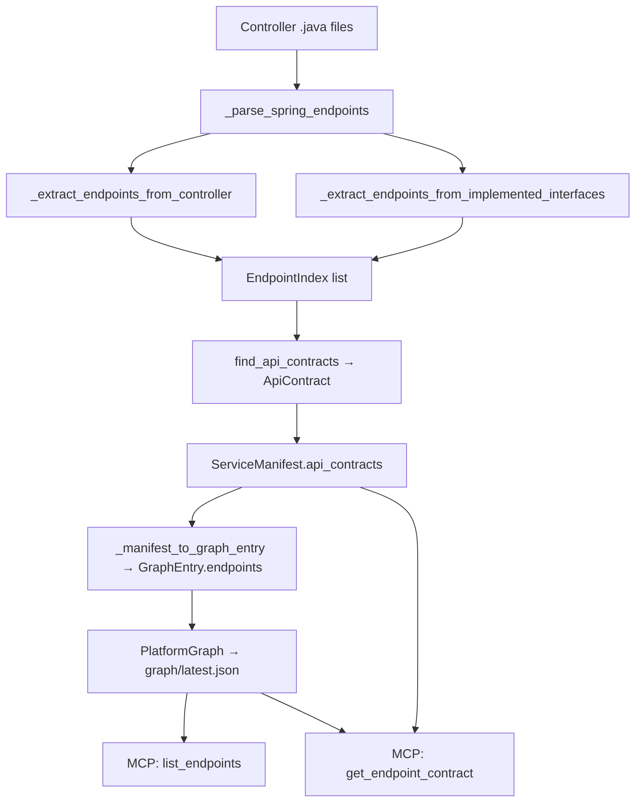

# Endpoint Parameters & Response Extraction Plan

## Overview

Enhance the Backend Java (Spring Boot) extractor to extract **request parameters**, **request bodies**, and **response objects** from Spring controller endpoints. This enriches the lightweight [`EndpointIndex`](src/cortex/schema.py:111) model with structured contract data, enabling the [`get_endpoint_contract`](mcp_server/server.py:411) MCP tool to return meaningful request/response schemas without requiring a separate OpenAPI spec file.

## Current State

The [`EndpointIndex`](src/cortex/schema.py:111) model captures only:
- `method`, `path`, `summary`, `tags`, `operation_id`

The extraction pipeline:
1. [`find_api_contracts()`](src/cortex/extractors/backend_java.py:167) → calls [`_parse_spring_endpoints()`](src/cortex/extractors/backend_java.py:509)
2. [`_parse_spring_endpoints()`](src/cortex/extractors/backend_java.py:509) → iterates controller files, calls [`_extract_endpoints_from_controller()`](src/cortex/extractors/backend_java.py:583)
3. [`_extract_endpoints_from_controller()`](src/cortex/extractors/backend_java.py:583) → uses regex windowing to find `@*Mapping` annotations, extracts path/summary/tags
4. [`_extract_endpoints_from_implemented_interfaces()`](src/cortex/extractors/backend_java.py:735) → handles `implements XxxApi` delegation pattern

The extractor currently scans method signatures only to find the closing `)` for window boundaries — it does NOT parse parameter types or return types.

## Data Flow Diagram



---

## 1. Schema Changes

### 1.1 New Pydantic Models in [`schema.py`](src/cortex/schema.py)

Add three new models before [`EndpointIndex`](src/cortex/schema.py:111):

```python
class EndpointParameter(BaseModel):
    """A single request parameter extracted from Spring annotations."""
    name: str
    location: str  # "query", "path", "header"
    type: str | None = None  # Java type: "String", "Long", "int", etc.
    required: bool | None = None  # None = not explicitly set
    default_value: str | None = None  # from defaultValue attribute


class EndpointRequestBody(BaseModel):
    """Request body type extracted from @RequestBody annotation."""
    type: str  # DTO class name: "CreateOrderRequest", "OrderDto"
    required: bool = True  # @RequestBody(required = false)


class EndpointResponse(BaseModel):
    """Response type extracted from method return type."""
    type: str  # Unwrapped type: "OrderDto", "List<OrderDto>", "void"
    wrapper: str | None = None  # Outer wrapper: "ResponseEntity", "Mono", "Flux", etc.
```

### 1.2 Extend [`EndpointIndex`](src/cortex/schema.py:111)

Add three new optional fields:

```python
class EndpointIndex(BaseModel):
    method: str | None = None
    path: str | None = None
    summary: str | None = None
    tags: list[str] = Field(default_factory=list)
    operation_id: str | None = None
    # New fields
    parameters: list[EndpointParameter] = Field(default_factory=list)
    request_body: EndpointRequestBody | None = None
    response: EndpointResponse | None = None
```

### 1.3 JSON Schema Update in [`manifest.schema.json`](schemas/manifest.schema.json)

Update the endpoint object schema inside `api_contracts.items.properties.endpoints.items` (line 157) and `outbound_calls.items.properties.endpoints.items` (line 265) to add:

```json
{
  "parameters": {
    "type": "array",
    "items": {
      "type": "object",
      "required": ["name", "location"],
      "properties": {
        "name": { "type": "string" },
        "location": { "type": "string", "enum": ["query", "path", "header"] },
        "type": { "type": "string" },
        "required": { "type": "boolean" },
        "default_value": { "type": "string" }
      },
      "additionalProperties": false
    }
  },
  "request_body": {
    "type": "object",
    "required": ["type"],
    "properties": {
      "type": { "type": "string" },
      "required": { "type": "boolean" }
    },
    "additionalProperties": false
  },
  "response": {
    "type": "object",
    "required": ["type"],
    "properties": {
      "type": { "type": "string" },
      "wrapper": { "type": "string" }
    },
    "additionalProperties": false
  }
}
```

### 1.4 Backward Compatibility

All new fields use defaults (`Field(default_factory=list)` for parameters, `None` for request_body/response). Existing manifests with no parameters/request_body/response will still validate. The JSON schema uses `additionalProperties: false` on the endpoint object — the new properties must be added there, but since they are not in `required`, old manifests remain valid.

---

## 2. Extractor Changes

### 2.1 New Private Methods

Add these methods to [`BackendJavaExtractor`](src/cortex/extractors/backend_java.py):

#### `_extract_method_signature(content, mapping_end_pos) -> str | None`

Extracts the full Java method signature from after the annotation cluster to the opening `{`. This is the raw text like:
```
public ResponseEntity<OrderDto> createOrder(@RequestBody CreateOrderRequest request, @PathVariable String id)
```

**Strategy:**
- Start from `mapping_end_pos` (after the `@*Mapping(...)` annotation arguments end)
- Skip any additional annotations between the mapping and the method signature
- Find the method signature by looking for the pattern: `<access_modifier>? <return_type> <method_name>(<params>)`
- Use brace/paren depth counting to handle generics in return types and parameters
- Return the text from the return type through the closing `)` of the parameter list

#### `_extract_parameters_from_signature(signature) -> list[EndpointParameter]`

Parses Spring parameter annotations from a method signature string.

**Strategy:**
1. Split the parameter list by commas (respecting generic depth with `<>` counting)
2. For each parameter token, check for:
   - `@RequestParam` → location="query"
   - `@PathVariable` → location="path"
   - `@RequestHeader` → location="header"
3. Extract annotation attributes: `name`/`value`, `required`, `defaultValue`
4. Extract the Java type and parameter name from the remaining tokens
5. If `name` is not specified in the annotation, use the Java parameter name

**Regex patterns:**
```python
# Match @RequestParam, @PathVariable, @RequestHeader with optional attributes
PARAM_ANNOTATION_RE = re.compile(
    r'@(RequestParam|PathVariable|RequestHeader)\s*'
    r'(?:\(\s*'
    r'(?:'
    r'(?:value|name)\s*=\s*["\']([^"\']+)["\']'  # named: value="x" or name="x"
    r'|["\']([^"\']+)["\']'                        # positional: "x"
    r'|([^)]*)'                                     # other attributes
    r')\s*\))?'
)
```

**Attribute extraction for `@RequestParam`:**
```java
@RequestParam(value = "page", required = false, defaultValue = "0") int page
@RequestParam("page") int page
@RequestParam int page  // name inferred from Java param name
```

#### `_extract_request_body_from_signature(signature) -> EndpointRequestBody | None`

Finds `@RequestBody` in the method signature and extracts the DTO type.

**Strategy:**
1. Search for `@RequestBody` in the signature
2. Check for `required = false` attribute
3. Extract the type token immediately after the annotation (handling generics)
4. Return `EndpointRequestBody(type=type_name, required=required)`

**Examples:**
```java
@RequestBody CreateOrderRequest request     → type="CreateOrderRequest"
@RequestBody List<OrderItemDto> items       → type="List<OrderItemDto>"
@RequestBody(required = false) UpdateDto d  → type="UpdateDto", required=False
```

#### `_extract_return_type_from_signature(signature) -> EndpointResponse | None`

Extracts the method return type and unwraps common wrappers.

**Strategy:**
1. Parse the return type from the method signature (between access modifier and method name)
2. Identify wrapper types: `ResponseEntity`, `Mono`, `Flux`, `CompletableFuture`, `DeferredResult`, `Callable`
3. Unwrap one level of generics for wrappers
4. Handle `void` return type
5. Handle `?` wildcard (e.g., `ResponseEntity<?>` → type="?", wrapper="ResponseEntity")

**Wrapper unwrapping logic:**
```
ResponseEntity<OrderDto>           → type="OrderDto", wrapper="ResponseEntity"
ResponseEntity<List<OrderDto>>     → type="List<OrderDto>", wrapper="ResponseEntity"
ResponseEntity<?>                  → type="?", wrapper="ResponseEntity"
Mono<ResponseEntity<OrderDto>>     → type="OrderDto", wrapper="Mono<ResponseEntity>"
Flux<OrderDto>                     → type="OrderDto", wrapper="Flux"
CompletableFuture<OrderDto>        → type="OrderDto", wrapper="CompletableFuture"
List<OrderDto>                     → type="List<OrderDto>", wrapper=None
OrderDto                           → type="OrderDto", wrapper=None
void                               → type="void", wrapper=None
```

#### `_split_params_respecting_generics(param_list_str) -> list[str]`

Splits a comma-separated parameter list while respecting `<>` generic depth.

**Example:**
```
"Map<String, List<Integer>> map, @RequestParam String name"
→ ["Map<String, List<Integer>> map", "@RequestParam String name"]
```

#### `_parse_java_type_token(tokens) -> str`

Reconstructs a Java type from tokens, handling generics like `List<OrderDto>`, `Map<String, Object>`, arrays like `String[]`, and varargs like `String...`.

### 2.2 Modifications to Existing Methods

#### [`_extract_endpoints_from_controller()`](src/cortex/extractors/backend_java.py:583)

**Current behavior:** For each `@*Mapping` match, extracts path/summary/tags and creates an `EndpointIndex`.

**New behavior:** After finding the mapping annotation and its arguments, also:
1. Locate the method signature (from after the annotation cluster to the opening `{`)
2. Call `_extract_parameters_from_signature()` on the signature
3. Call `_extract_request_body_from_signature()` on the signature
4. Call `_extract_return_type_from_signature()` on the signature
5. Pass results to the `EndpointIndex` constructor

The method already computes `ann_args_end` and `post_window` — the method signature is within the `post_window` text. The key change is to extract the full method signature text from `post_window` and parse it.

**Specific insertion point:** After line 723 (where `full_path` is computed) and before line 725 (where `EndpointIndex` is constructed), add:

```python
# Extract method signature for parameter/body/response parsing
method_sig = self._extract_method_signature(post_window)
parameters = self._extract_parameters_from_signature(method_sig) if method_sig else []
request_body = self._extract_request_body_from_signature(method_sig) if method_sig else None
response = self._extract_return_type_from_signature(method_sig) if method_sig else None

endpoint = EndpointIndex(
    method=http_verb,
    path=full_path,
    summary=summary,
    tags=[tag] if tag else [],
    parameters=parameters,
    request_body=request_body,
    response=response,
)
```

#### [`_extract_endpoints_from_implemented_interfaces()`](src/cortex/extractors/backend_java.py:735)

No direct changes needed — this method delegates to `_extract_endpoints_from_controller()`, which will now extract parameters/body/response from the interface method signatures.

### 2.3 Scope Boundary: `@HttpExchange` Endpoints

The [`_scan_http_exchange_interfaces()`](src/cortex/extractors/backend_java.py:1959) method also creates `EndpointIndex` objects for outbound call endpoints. These could also benefit from parameter/response extraction, but this is a **separate concern** (outbound calls vs. inbound API surface). Recommend deferring `@HttpExchange` parameter extraction to a follow-up task to keep this change focused.

---

## 3. Parsing Strategy

### 3.1 Method Signature Extraction

The core challenge is reliably extracting the method signature from the post-window text. The post-window already contains the text between the `@*Mapping` annotation and the next `@*Mapping` or end of file.

**Algorithm:**
1. Start from the beginning of `post_window` (which is after the mapping annotation args)
2. Skip any additional annotations (e.g., `@Operation`, `@Tag`, `@ApiResponse`, etc.)
3. Find the method signature pattern: look for the first occurrence of a Java access modifier or return type followed by a method name and `(`
4. Extract from the return type through the matching `)` using paren-depth counting

**Regex for finding method signature start:**
```python
METHOD_SIG_RE = re.compile(
    r'(?:public|protected|private|default)?\s*'  # optional access modifier
    r'(?:static\s+)?'                             # optional static
    r'(?:final\s+)?'                              # optional final
    r'([\w<>,\s\?\[\]\.]+?)\s+'                   # return type (greedy but bounded)
    r'(\w+)\s*\(',                                 # method name + opening paren
    re.DOTALL,
)
```

### 3.2 Parameter Parsing

For each parameter in the comma-split list:

```
@RequestParam(value = "status", required = false) String status
│             │                                   │      │
│             └─ annotation attributes ──────────┘      │
│                                                        │
└─ annotation name                          Java type + param name
```

**Steps:**
1. Strip leading/trailing whitespace
2. Check for `@RequestParam`, `@PathVariable`, or `@RequestHeader`
3. If annotation found, extract its attributes (name/value, required, defaultValue)
4. Remove the annotation text from the token
5. Parse remaining tokens as `<type> <name>` (handling generics)
6. If no explicit name in annotation, use the Java parameter name

**Handling `@PathVariable` name inference:**
```java
@PathVariable String id           → name="id" (from Java param name)
@PathVariable("orderId") String id → name="orderId" (from annotation)
```

### 3.3 Return Type Parsing

**Algorithm:**
1. From the method signature, extract the return type (everything before the method name)
2. Strip access modifiers (`public`, `protected`, `private`, `default`, `static`, `final`)
3. Check if the outermost type is a known wrapper
4. If wrapper found, unwrap one level of generics
5. Handle nested wrappers (e.g., `Mono<ResponseEntity<T>>`)

**Known wrapper types (constant list):**
```python
_RESPONSE_WRAPPERS = frozenset({
    "ResponseEntity",
    "Mono",
    "Flux",
    "CompletableFuture",
    "DeferredResult",
    "Callable",
    "ListenableFuture",
    "Future",
})
```

### 3.4 Generic Type Parsing

A reusable helper to extract the inner type from `Outer<Inner>`:

```python
def _unwrap_generic(type_str: str) -> tuple[str, str | None]:
    """Returns (inner_type, outer_type) or (type_str, None) if not generic."""
    depth = 0
    for i, ch in enumerate(type_str):
        if ch == '<':
            if depth == 0:
                outer = type_str[:i].strip()
                # Find matching >
                inner_start = i + 1
                for j in range(i, len(type_str)):
                    if type_str[j] == '<': depth += 1
                    elif type_str[j] == '>': depth -= 1
                    if depth == 0:
                        inner = type_str[inner_start:j].strip()
                        return inner, outer
            depth += 1
    return type_str, None
```

---

## 4. Edge Cases

### 4.1 Generics and Nested Types
- `ResponseEntity<List<OrderDto>>` → unwrap ResponseEntity, keep `List<OrderDto>` as the type
- `Map<String, Object>` → keep as-is (not a wrapper)
- `ResponseEntity<Map<String, List<OrderDto>>>` → type=`Map<String, List<OrderDto>>`, wrapper=`ResponseEntity`
- `Mono<ResponseEntity<OrderDto>>` → type=`OrderDto`, wrapper=`Mono<ResponseEntity>`

### 4.2 Wildcard Types
- `ResponseEntity<?>` → type=`?`, wrapper=`ResponseEntity`
- `ResponseEntity<? extends BaseDto>` → type=`? extends BaseDto`, wrapper=`ResponseEntity`

### 4.3 Void and Primitive Returns
- `void` → type=`void`, wrapper=None
- `ResponseEntity<Void>` → type=`Void`, wrapper=`ResponseEntity`
- `int`, `long`, `boolean` → type as-is, wrapper=None

### 4.4 Array Types
- `OrderDto[]` → type=`OrderDto[]`, wrapper=None
- `byte[]` → type=`byte[]`, wrapper=None

### 4.5 No Parameters
- `public ResponseEntity<OrderDto> listOrders()` → parameters=[], request_body=None

### 4.6 Mixed Parameter Types
```java
public ResponseEntity<OrderDto> getOrder(
    @PathVariable String id,
    @RequestParam(required = false) String expand,
    @RequestHeader("X-Correlation-Id") String correlationId,
    @RequestBody UpdateOrderRequest body
)
```
→ 3 parameters + 1 request_body

### 4.7 Unannotated Parameters
Parameters without Spring annotations (e.g., `HttpServletRequest request`, `Principal principal`, `Pageable pageable`) should be **skipped** — they are framework-injected, not part of the API contract.

### 4.8 Multi-line Signatures
```java
@PostMapping("/orders")
@Operation(summary = "Create order")
public ResponseEntity<OrderDto> createOrder(
        @RequestBody CreateOrderRequest request,
        @RequestHeader("Authorization") String auth
) {
```
The signature spans multiple lines. The regex/parsing must handle `re.DOTALL` or newline-aware matching.

### 4.9 Interface Methods (no body)
```java
@GetMapping("/{id}")
OrderDto getOrder(@PathVariable String id);
```
Interface methods end with `;` instead of `{`. The signature extraction must handle both terminators.

### 4.10 Kotlin Controllers
Some repos may have `.kt` controller files. Kotlin syntax differs significantly:
```kotlin
@GetMapping("/{id}")
fun getOrder(@PathVariable id: String): ResponseEntity<OrderDto>
```
**Decision:** Defer Kotlin support to a follow-up task. The current extractor already only scans `.java` files for controllers. Document this limitation.

### 4.11 Lombok `@Data` / Records
These affect DTO classes, not the controller method signatures. No impact on parameter extraction — we only capture the type name, not the DTO's internal structure.

### 4.12 `@RequestMapping` with method attribute
```java
@RequestMapping(value = "/orders", method = RequestMethod.GET)
```
The current extractor handles `@*Mapping` annotations but not `@RequestMapping` with a `method` attribute at the method level. This is an existing limitation and out of scope for this change.

### 4.13 Default Values with Special Characters
```java
@RequestParam(defaultValue = "0,10") String range
@RequestParam(defaultValue = "") String filter
```
The regex must handle commas and empty strings inside `defaultValue`.

---

## 5. Test Plan

### 5.1 Update Fixture Controllers

Enhance the existing fixture files to include parameters, request bodies, and return types:

#### Update [`OrderController.java`](tests/fixtures/sample-backend-java-repo/src/main/java/com/example/demo/controllers/orders/OrderController.java)

Add realistic method signatures:
```java
@GetMapping
@Operation(summary = "List all orders")
public ResponseEntity<List<OrderDto>> listOrders(
        @RequestParam(value = "status", required = false) String status,
        @RequestParam(defaultValue = "0") int page) {
    return ResponseEntity.ok().build();
}

@PostMapping
@Operation(summary = "Create a new order")
public ResponseEntity<OrderDto> createOrder(@RequestBody CreateOrderRequest request) {
    return ResponseEntity.ok().build();
}

@GetMapping("/{id}")
@Operation(summary = "Get order by ID")
public ResponseEntity<OrderDto> getOrder(@PathVariable String id) {
    return ResponseEntity.ok().build();
}

@DeleteMapping("/{id}")
@Operation(summary = "Cancel an order")
public ResponseEntity<Void> cancelOrder(
        @PathVariable String id,
        @RequestHeader("X-Correlation-Id") String correlationId) {
    return ResponseEntity.ok().build();
}
```

#### Update [`RewardsApi.java`](tests/fixtures/sample-backend-java-repo/src/main/java/com/example/demo/entrypoints/api/RewardsApi.java)

Add parameter annotations to interface methods:
```java
@GetMapping("/{rewardId}")
Object getReward(@PathVariable String rewardId);

@PostMapping("/{rewardId}/redeem")
Object redeemReward(@PathVariable String rewardId);
```
These already have `@PathVariable` — verify they are extracted.

### 5.2 New Test Cases

Add a new test class `TestEndpointParameterExtraction` in [`test_backend_java_extractor.py`](tests/test_backend_java_extractor.py):

#### Parameter Extraction Tests
1. **`test_path_variable_extracted`** — `@PathVariable String id` → parameter with location=path
2. **`test_request_param_extracted`** — `@RequestParam String status` → parameter with location=query
3. **`test_request_param_with_attributes`** — `@RequestParam(value="status", required=false, defaultValue="active")` → all attributes captured
4. **`test_request_header_extracted`** — `@RequestHeader("X-Correlation-Id")` → parameter with location=header
5. **`test_multiple_parameters`** — method with path + query + header params → all extracted
6. **`test_unannotated_params_skipped`** — `HttpServletRequest`, `Principal` → not in parameters list
7. **`test_path_variable_name_from_annotation`** — `@PathVariable("orderId") String id` → name=orderId
8. **`test_path_variable_name_inferred`** — `@PathVariable String id` → name=id
9. **`test_request_param_default_value`** — `@RequestParam(defaultValue = "0") int page` → default_value="0"

#### Request Body Tests
10. **`test_request_body_extracted`** — `@RequestBody CreateOrderRequest req` → type=CreateOrderRequest
11. **`test_request_body_with_generic`** — `@RequestBody List<OrderItemDto> items` → type=List<OrderItemDto>
12. **`test_request_body_optional`** — `@RequestBody(required = false) UpdateDto dto` → required=False
13. **`test_no_request_body`** — GET method with no body → request_body=None

#### Response Type Tests
14. **`test_response_entity_unwrapped`** — `ResponseEntity<OrderDto>` → type=OrderDto, wrapper=ResponseEntity
15. **`test_response_entity_list`** — `ResponseEntity<List<OrderDto>>` → type=List<OrderDto>, wrapper=ResponseEntity
16. **`test_response_entity_wildcard`** — `ResponseEntity<?>` → type=?, wrapper=ResponseEntity
17. **`test_response_entity_void`** — `ResponseEntity<Void>` → type=Void, wrapper=ResponseEntity
18. **`test_void_return`** — `void` → type=void, wrapper=None
19. **`test_mono_unwrapped`** — `Mono<OrderDto>` → type=OrderDto, wrapper=Mono
20. **`test_flux_unwrapped`** — `Flux<OrderDto>` → type=OrderDto, wrapper=Flux
21. **`test_plain_dto_return`** — `OrderDto` → type=OrderDto, wrapper=None
22. **`test_list_return_no_wrapper`** — `List<OrderDto>` → type=List<OrderDto>, wrapper=None
23. **`test_nested_wrapper`** — `Mono<ResponseEntity<OrderDto>>` → type=OrderDto, wrapper=Mono<ResponseEntity>

#### Integration Tests
24. **`test_fixture_endpoints_have_parameters`** — verify fixture OrderController endpoints have expected parameters
25. **`test_fixture_interface_endpoints_have_parameters`** — verify RewardsApi interface endpoints have @PathVariable extracted
26. **`test_endpoint_with_no_params_has_empty_list`** — endpoints like `/health` have parameters=[]
27. **`test_multi_line_signature_parsed`** — method signature spanning multiple lines

#### Backward Compatibility Tests
28. **`test_endpoint_index_defaults`** — `EndpointIndex(method="GET", path="/test")` → parameters=[], request_body=None, response=None
29. **`test_existing_manifest_still_validates`** — load an old-format manifest dict, validate it still parses

### 5.3 Unit Tests for Helper Methods

Add a test class `TestMethodSignatureParsing`:

1. **`test_extract_method_signature_simple`** — basic `public String method()`
2. **`test_extract_method_signature_with_generics`** — `ResponseEntity<List<OrderDto>>`
3. **`test_split_params_respecting_generics`** — `Map<String, List<Integer>> map, String name`
4. **`test_split_params_empty`** — empty parameter list
5. **`test_unwrap_generic_simple`** — `ResponseEntity<OrderDto>` → (OrderDto, ResponseEntity)
6. **`test_unwrap_generic_nested`** — `Mono<ResponseEntity<OrderDto>>`
7. **`test_unwrap_generic_not_generic`** — `String` → (String, None)

---

## 6. Downstream Impact

### 6.1 Aggregator ([`aggregator.py`](src/cortex/aggregator.py))

The [`_manifest_to_graph_entry()`](src/cortex/aggregator.py:148) function creates `EndpointIndex` objects from manifest dicts. It currently maps `method`, `path`, `summary`, `tags`, `operation_id`. It must be updated to also map:
- `parameters` → list of `EndpointParameter` dicts
- `request_body` → `EndpointRequestBody` dict or None
- `response` → `EndpointResponse` dict or None

### 6.2 MCP Server ([`server.py`](mcp_server/server.py))

The [`get_endpoint_contract`](mcp_server/server.py:411) tool currently returns a message saying "No API spec file found" for backend services without an OpenAPI file. With the new fields on `EndpointIndex`, it can be enhanced to:
1. Look up the specific endpoint in the graph's endpoint list
2. Return the `parameters`, `request_body`, and `response` data from the `EndpointIndex`
3. Fall back to the current behavior only if no extracted data exists

**This MCP enhancement is a follow-up task** — the current plan focuses on extraction and schema. The MCP tool can be updated separately once the data is flowing.

### 6.3 `GraphEntry` in [`schema.py`](src/cortex/schema.py:226)

[`GraphEntry.endpoints`](src/cortex/schema.py:238) is typed as `list[EndpointIndex]`, so it automatically picks up the new fields. No model change needed.

---

## 7. Implementation Order

### Step 1: Schema Models
- Add `EndpointParameter`, `EndpointRequestBody`, `EndpointResponse` to [`schema.py`](src/cortex/schema.py)
- Extend [`EndpointIndex`](src/cortex/schema.py:111) with new optional fields
- Update [`manifest.schema.json`](schemas/manifest.schema.json) endpoint object schema
- Write backward compatibility tests

### Step 2: Helper Methods
- Implement `_extract_method_signature()` in [`backend_java.py`](src/cortex/extractors/backend_java.py)
- Implement `_split_params_respecting_generics()`
- Implement `_parse_java_type_token()`
- Write unit tests for these helpers

### Step 3: Parameter Extraction
- Implement `_extract_parameters_from_signature()`
- Write parameter extraction tests (path, query, header, attributes, edge cases)

### Step 4: Request Body Extraction
- Implement `_extract_request_body_from_signature()`
- Write request body tests

### Step 5: Response Type Extraction
- Implement `_extract_return_type_from_signature()`
- Implement generic unwrapping logic
- Write response type tests (wrappers, generics, void, wildcards)

### Step 6: Integration into Controller Extraction
- Modify [`_extract_endpoints_from_controller()`](src/cortex/extractors/backend_java.py:583) to call the new methods
- Update fixture controller files with realistic signatures
- Write integration tests against fixtures

### Step 7: Aggregator Update
- Update [`_manifest_to_graph_entry()`](src/cortex/aggregator.py:148) to pass through new fields
- Update aggregator tests

### Step 8: Validation & Smoke Test
- Run full test suite: `uv run pytest tests/ mcp_server/tests/ -v`
- Run coverage check: `uv run pytest --cov=cortex tests/ mcp_server/tests/ -v` (must stay above 75%)
- Run smoke test: `uv run cortex run-local --config config/repos-fixtures.yaml --output-dir /tmp/cortex-smoke`
- Run linter: `uv run ruff check src/ tests/ mcp_server/`
- Verify generated `manifest.json` contains new fields for fixture endpoints

---

## 8. Out of Scope

1. **Kotlin controller parsing** — different syntax, defer to follow-up
2. **`@HttpExchange` parameter extraction** — outbound calls, separate concern
3. **DTO field introspection** — we capture the type name only, not its fields
4. **`@RequestMapping(method = ...)` at method level** — existing limitation
5. **MCP `get_endpoint_contract` enhancement** — follow-up task to surface extracted data
6. **OpenAPI spec generation** — we extract metadata, not generate specs
7. **`@ApiResponse` / `@ApiResponses` parsing** — OpenAPI response documentation annotations; could be a follow-up
