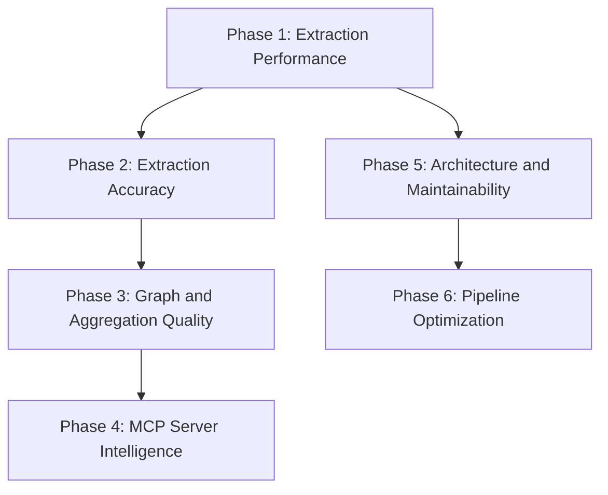

# Cortex Performance & Accuracy Improvement Plan

## Executive Summary

Platform Cortex is the architectural intelligence layer for the ecosystem — it extracts structured metadata from Android, iOS, and backend Java repositories, aggregates it into a queryable graph, and exposes it to AI agents via an MCP server. This plan addresses **27 identified issues** across performance, accuracy, MCP tool quality, architecture, and data model gaps.

**Why this matters:** Every improvement directly enhances what AI agents can discover and reason about. Faster extraction means fresher data. More accurate parsing means fewer blind spots. Richer graph entries mean agents get better answers. Better search scoring means agents find the right service on the first query.

**Scope:** 6 phases, ordered by ROI — extraction performance first (biggest bang), then accuracy, graph quality, MCP intelligence, architecture cleanup, and pipeline optimization.

### Impact Summary

| Phase | Primary Benefit | Agent Impact |
|-------|----------------|--------------|
| 1 — Extraction Performance | 3-5x faster extraction per repo | Fresher data, faster pipeline runs |
| 2 — Extraction Accuracy | Catch 30-40% more endpoints and configs | Fewer blind spots in service discovery |
| 3 — Graph & Aggregation | Richer graph entries, resolved env: URLs | Agents see outbound calls, DB types, versions |
| 4 — MCP Server Intelligence | Better search, auto-refresh, richer responses | More relevant results, live data |
| 5 — Architecture & Maintainability | Decomposed extractor, shared parsers | Faster future development, fewer bugs |
| 6 — Pipeline Optimization | Parallel + incremental extraction | Pipeline time from 3-8 min to under 1 min |

### Phase Dependency Graph



**Recommended execution order:** P1 → P2 → P3 → P4 → P5 → P6

Phases 1 and 2 are sequential because the file index from Phase 1 is a prerequisite for the accuracy improvements in Phase 2. Phase 5 can run in parallel with Phases 3-4 if multiple developers are available.

---

## Phase 1: Extraction Performance

**Goal:** Eliminate redundant file system traversals and repeated parsing in the backend Java extractor, reducing per-repo extraction time by 3-5x.

**Dependencies:** None — this is the foundation.

**Risk:** Medium. Refactoring the file traversal pattern touches many methods. Thorough testing with the existing fixture suite mitigates regression risk.

### Task 1.1: Build a `RepoFileIndex` Data Class

**Issue:** P1 — The backend Java extractor performs **12+ separate `rglob()` traversals** of the entire repo tree during a single extraction.

**What:** Create a `RepoFileIndex` dataclass that walks the repo tree once at the start of [`extract()`](src/cortex/extractors/backend_java.py:1) and caches categorized file lists.

**Affected files:**
- [`src/cortex/extractors/backend_java.py`](src/cortex/extractors/backend_java.py) — new `RepoFileIndex` class, modify `extract()` entry point

**Implementation details:**
```
@dataclass
class RepoFileIndex:
    java_files: list[Path]        # *.java, excluding build/test dirs
    kotlin_files: list[Path]      # *.kt, excluding build/test dirs
    all_source_files: list[Path]  # java + kotlin combined
    gradle_files: list[Path]      # build.gradle, build.gradle.kts
    yaml_files: list[Path]        # application*.yml
    properties_files: list[Path]  # application*.properties (for Task 2.3)
    dockerfile: Path | None
    ci_files: list[Path]
```

- Single `root.rglob("*")` call, categorize by extension
- Apply `_EXCLUDED_DIRS` and `_TEST_DIR_SEGMENTS` filtering once
- Pass `RepoFileIndex` to all extraction methods

**Effort:** M

**Acceptance criteria:**
- [ ] `RepoFileIndex` is built once per `extract()` call
- [ ] Zero `rglob()` calls remain in individual extraction methods
- [ ] All existing tests pass without modification
- [ ] Extraction time for `sample-backend-java-repo` fixture is measurably faster

### Task 1.2: Cache YAML Flat Properties

**Issue:** P2 — [`_load_yaml_flat_props()`](src/cortex/extractors/backend_java.py:2085) is called 3 separate times during extraction.

**What:** Call `_load_yaml_flat_props()` once in `extract()` and pass the result to [`_parse_kafka_producers()`](src/cortex/extractors/backend_java.py:1922), [`_parse_kafka_consumers()`](src/cortex/extractors/backend_java.py:2051), and [`_parse_outbound_service_calls()`](src/cortex/extractors/backend_java.py:2253).

**Affected files:**
- [`src/cortex/extractors/backend_java.py`](src/cortex/extractors/backend_java.py) — modify `extract()`, `_parse_kafka_producers()`, `_parse_kafka_consumers()`, `_parse_outbound_service_calls()`

**Effort:** S

**Acceptance criteria:**
- [ ] `_load_yaml_flat_props()` is called exactly once per extraction
- [ ] All Kafka and outbound call tests pass unchanged

### Task 1.3: Cache Static String Constants

**Issue:** P3 — [`_scan_java_for_static_string_constants()`](src/cortex/extractors/backend_java.py:1665) is called twice — from `_parse_kafka_producers()` and `_parse_kafka_consumers()`.

**What:** Call `_scan_java_for_static_string_constants()` once in `extract()` and pass the result to both Kafka parsing methods.

**Affected files:**
- [`src/cortex/extractors/backend_java.py`](src/cortex/extractors/backend_java.py) — modify `extract()`, `_parse_kafka_producers()`, `_parse_kafka_consumers()`

**Effort:** S

**Acceptance criteria:**
- [ ] `_scan_java_for_static_string_constants()` is called exactly once per extraction
- [ ] Kafka topic resolution tests pass unchanged

### Task 1.4: Pre-compile Regex Patterns as Module-Level Constants

**Issue:** P4 — Regex patterns are compiled inside method bodies and loops.

**What:** Move regex compilation to module-level `re.compile()` constants for patterns in:
- [`_parse_gradle_deps()`](src/cortex/extractors/backend_java.py:623) — `map_pattern` compiled per call
- [`_extract_endpoints_from_controller()`](src/cortex/extractors/backend_java.py:752) — `method_pattern` compiled per controller file

**Affected files:**
- [`src/cortex/extractors/backend_java.py`](src/cortex/extractors/backend_java.py) — move patterns to module-level constants

**Effort:** S

**Acceptance criteria:**
- [ ] All regex patterns used in hot paths are module-level constants
- [ ] No `re.compile()` calls inside method bodies that are called per-file
- [ ] All existing tests pass

---

## Phase 2: Extraction Accuracy

**Goal:** Close the most impactful parsing gaps — handle `@RequestMapping` with method attributes, Kotlin controllers, `application.properties` files, and reduce Kafka topic false positives.

**Dependencies:** Phase 1 (uses `RepoFileIndex` for efficient file access).

**Risk:** Medium. New parsing patterns need careful regex design and thorough test coverage with real-world examples.

### Task 2.1: Parse `@RequestMapping` with `method` Attribute

**Issue:** A1 + A7 — [`_extract_endpoints_from_controller()`](src/cortex/extractors/backend_java.py:752) only handles `@GetMapping`, `@PostMapping`, etc. It does NOT handle `@RequestMapping(value = "/path", method = RequestMethod.GET)` at either class or method level.

**What:** Extend the method pattern regex at [line 752](src/cortex/extractors/backend_java.py:752) to also match `@RequestMapping` annotations that include a `method = RequestMethod.XXX` attribute. Extract the HTTP verb from the `RequestMethod` enum value.

**Affected files:**
- [`src/cortex/extractors/backend_java.py`](src/cortex/extractors/backend_java.py) — modify `_extract_endpoints_from_controller()`
- [`tests/test_backend_java_extractor.py`](tests/test_backend_java_extractor.py) — add test cases for `@RequestMapping` with method attribute

**Implementation details:**
- Add a second regex pattern: `@RequestMapping\s*\([^)]*method\s*=\s*RequestMethod\.(\w+)`
- Extract path from `value` or first positional argument
- Handle both single method and array of methods: `method = {RequestMethod.GET, RequestMethod.POST}`
- Merge results with existing `@XxxMapping` matches

**Effort:** M

**Acceptance criteria:**
- [ ] `@RequestMapping(value = "/path", method = RequestMethod.GET)` produces a GET endpoint
- [ ] `@RequestMapping(method = RequestMethod.POST, value = "/path")` works regardless of attribute order
- [ ] `@RequestMapping` without `method` attribute defaults to all HTTP methods or is skipped
- [ ] Test fixture updated with `@RequestMapping` examples

### Task 2.2: Support Kotlin Source Files for Endpoint Extraction

**Issue:** A3 — [`_parse_spring_endpoints()`](src/cortex/extractors/backend_java.py:670) only scans `*.java` files. Spring Boot controllers written in Kotlin are completely missed.

**What:** Extend `_parse_spring_endpoints()` to also scan `*.kt` files from the `RepoFileIndex`. Kotlin uses the same Spring annotations, so the existing regex patterns should work with minor adjustments for Kotlin syntax differences like `fun` instead of `public`.

**Affected files:**
- [`src/cortex/extractors/backend_java.py`](src/cortex/extractors/backend_java.py) — modify `_parse_spring_endpoints()` to use `RepoFileIndex.all_source_files`
- [`tests/test_backend_java_extractor.py`](tests/test_backend_java_extractor.py) — add Kotlin controller test fixture
- [`tests/fixtures/sample-backend-java-repo/`](tests/fixtures/sample-backend-java-repo/) — add a Kotlin controller file

**Implementation details:**
- Use `file_index.all_source_files` instead of `root.rglob("*.java")`
- Adjust method signature regex to handle Kotlin `fun` declarations
- Kotlin return types use `: Type` syntax instead of Java prefix types
- Test with a Kotlin `@RestController` that uses `@GetMapping`

**Effort:** M

**Acceptance criteria:**
- [ ] Kotlin `@RestController` classes are discovered and parsed
- [ ] Endpoints from Kotlin controllers appear in `api_contracts`
- [ ] Existing Java controller tests still pass
- [ ] At least one Kotlin controller in the test fixture

### Task 2.3: Parse `application.properties` Files

**Issue:** A4 — All YAML parsing methods only look for `application*.yml`. Services using `application.properties` have their configs silently missed.

**What:** Extend [`_load_yaml_flat_props()`](src/cortex/extractors/backend_java.py:2085) and [`_parse_kafka_topics()`](src/cortex/extractors/backend_java.py:1567) to also read `application*.properties` files. Properties files use simple `key=value` format.

**Affected files:**
- [`src/cortex/extractors/backend_java.py`](src/cortex/extractors/backend_java.py) — modify `_load_yaml_flat_props()`, `_parse_kafka_topics()`
- [`tests/test_backend_java_extractor.py`](tests/test_backend_java_extractor.py) — add properties file test cases
- [`tests/fixtures/sample-backend-java-repo/`](tests/fixtures/sample-backend-java-repo/) — optionally add an `application.properties` file

**Implementation details:**
- Add a `_load_properties_flat_props(file: Path) -> dict[str, str]` method
- Parse lines matching `key=value` or `key = value`, skip comments starting with `#`
- Merge properties into the same flat dict as YAML props (YAML takes precedence on conflicts)
- Use `RepoFileIndex.properties_files` from Task 1.1

**Effort:** S

**Acceptance criteria:**
- [ ] `application.properties` values are available for Spring EL resolution
- [ ] Kafka topics defined in `.properties` files are discovered
- [ ] YAML values take precedence over `.properties` values for the same key
- [ ] Test case with a `.properties` file passes

### Task 2.4: Reduce Kafka Topic False Positives

**Issue:** A5 — The fallback mechanism in [`_parse_kafka_producers()`](src/cortex/extractors/backend_java.py:1922) scans the entire codebase for `@Value` fields containing "kafka" or "topic", which can produce false positives.

**What:** Tighten the fallback heuristic to only match `@Value` fields that are actually used as arguments to `kafkaTemplate.send()` or `ProducerRecord` constructors in the same class.

**Affected files:**
- [`src/cortex/extractors/backend_java.py`](src/cortex/extractors/backend_java.py) — modify fallback logic in `_parse_kafka_producers()`
- [`tests/test_backend_java_extractor.py`](tests/test_backend_java_extractor.py) — add false positive test case

**Implementation details:**
- Instead of scanning all `@Value` fields with "kafka"/"topic" in the key, only consider `@Value` fields in files that also contain `kafkaTemplate` or `ProducerRecord`
- Cross-reference field names used in `send()` calls with `@Value` field names in the same file
- Remove the broad codebase-wide scan; rely on per-file resolution from [`_scan_value_injected_fields_in_file()`](src/cortex/extractors/backend_java.py:1780)

**Effort:** M

**Acceptance criteria:**
- [ ] `@Value` fields in non-Kafka classes are not reported as Kafka topics
- [ ] Legitimate Kafka topics from `@Value` fields in producer classes are still found
- [ ] No regression in existing Kafka topic tests

### Task 2.5: Resolve `env:` Prefixed URLs to Communication Edges

**Issue:** A9 — When outbound calls have `target_url` like `"env:CLEAR_AUTH_BASE_URL"`, the HTTP edge resolver in [`_resolve_http_edges()`](src/cortex/aggregator.py:275) tries to regex-match `https?://` which never matches. These outbound calls are invisible in the communication graph.

**What:** Add `env:` URL handling to [`_resolve_http_edges()`](src/cortex/aggregator.py:275). Extract the environment variable name, tokenize it, and match against service names using the same heuristic as `config_key` matching.

**Affected files:**
- [`src/cortex/aggregator.py`](src/cortex/aggregator.py) — modify `_resolve_http_edges()` at [line 275](src/cortex/aggregator.py:275)
- [`tests/test_aggregator.py`](tests/test_aggregator.py) — add test cases for `env:` URL resolution

**Implementation details:**
- Before the `url_match = re.search(r"https?://...")` check, add a branch for `target_url.startswith("env:")`
- Extract the env var name: `CLEAR_AUTH_BASE_URL` → tokenize to `["clear", "auth"]`
- Match tokens against service names using the same `svc_base` substring logic
- Example: `env:CLEAR_AUTH_BASE_URL` → matches `clear-auth-microservice` via base `clear-auth`

**Effort:** M

**Acceptance criteria:**
- [ ] `env:CLEAR_AUTH_BASE_URL` resolves to an edge targeting `clear-auth-microservice`
- [ ] Existing HTTP URL resolution still works
- [ ] identity-microservice's 8 outbound calls with `env:` URLs produce edges
- [ ] Test case with `env:` URLs passes

---

## Phase 3: Graph & Aggregation Quality

**Goal:** Enrich `GraphEntry` with critical backend metadata that is currently dropped during aggregation, and improve edge resolution quality.

**Dependencies:** Phase 2 (env: URL resolution).

**Risk:** Low-Medium. Schema changes require updating both Pydantic models and JSON Schema files, plus downstream consumers.

### Task 3.1: Enrich `GraphEntry` with Backend Metadata

**Issue:** A11 / M4 — [`_manifest_to_graph_entry()`](src/cortex/aggregator.py:151) drops: `outbound_calls`, `database_type`, `cache_type`, `spring_boot_version`, `java_version`, `dto_schemas`, `swagger_url`.

**What:** Add missing fields to [`GraphEntry`](src/cortex/schema.py:285) and populate them in [`_manifest_to_graph_entry()`](src/cortex/aggregator.py:151).

**Affected files:**
- [`src/cortex/schema.py`](src/cortex/schema.py) — add fields to `GraphEntry` at [line 285](src/cortex/schema.py:285)
- [`src/cortex/aggregator.py`](src/cortex/aggregator.py) — update `_manifest_to_graph_entry()` at [line 151](src/cortex/aggregator.py:151)
- [`schemas/manifest.schema.json`](schemas/manifest.schema.json) — update graph entry schema if applicable
- [`tests/test_aggregator.py`](tests/test_aggregator.py) — update assertions for new fields

**New fields on `GraphEntry`:**
```
database_type: str | None = None
cache_type: str | None = None
spring_boot_version: str | None = None
java_version: str | None = None
swagger_url: str | None = None
outbound_calls: list[OutboundCall] = Field(default_factory=list)
```

**Effort:** M

**Acceptance criteria:**
- [ ] `GraphEntry` includes all listed fields
- [ ] `_manifest_to_graph_entry()` populates them from manifest data
- [ ] `graph/latest.json` output includes the new fields
- [ ] MCP server can access these fields from the graph
- [ ] Both JSON Schema and Pydantic model are in sync

### Task 3.2: Improve Edge Resolution Confidence Scoring

**What:** Refine the confidence scores in [`_resolve_http_edges()`](src/cortex/aggregator.py:275) and [`_resolve_kafka_edges()`](src/cortex/aggregator.py:221) based on match quality.

**Affected files:**
- [`src/cortex/aggregator.py`](src/cortex/aggregator.py) — modify `_resolve_http_edges()`, `_resolve_kafka_edges()`
- [`tests/test_aggregator.py`](tests/test_aggregator.py) — update edge confidence assertions

**Implementation details:**
- HTTP edges from direct URL hostname match: confidence 0.9
- HTTP edges from config key match: confidence 0.7
- HTTP edges from `env:` variable name match: confidence 0.6
- Kafka edges with resolved default topic names: confidence 0.95
- Kafka edges with only env var names: confidence 0.7

**Effort:** S

**Acceptance criteria:**
- [ ] Edge confidence values reflect match quality
- [ ] Agents can filter edges by confidence threshold

---

## Phase 4: MCP Server Intelligence

**Goal:** Improve search relevance, enable graph auto-refresh, and provide richer tool responses.

**Dependencies:** Phase 3 (enriched graph entries).

**Risk:** Low. Changes are additive and backward-compatible.

### Task 4.1: Enhance `find_relevant_services` Search Scoring

**Issue:** T1 — [`_score_service()`](mcp_server/server.py:725) does not match against `endpoint.summary`, `endpoint.tags`, `kafka_produces`/`kafka_consumes` topic names, or `outbound_calls` config keys.

**What:** Add scoring dimensions to [`_score_service()`](mcp_server/server.py:725) for endpoint summaries, tags, Kafka topics, and outbound call targets.

**Affected files:**
- [`mcp_server/server.py`](mcp_server/server.py) — modify `_score_service()` at [line 725](mcp_server/server.py:725)
- [`mcp_server/tests/test_mcp_tools.py`](mcp_server/tests/test_mcp_tools.py) — add search scoring tests

**New scoring dimensions:**
```
endpoint.summary tokens:     1.0x weight
endpoint.tags tokens:        1.5x weight
kafka_produces topic tokens: 1.5x weight
kafka_consumes topic tokens: 1.5x weight
outbound_calls config_key:   1.0x weight
database_type:               1.5x weight  (after Phase 3)
```

**Effort:** M

**Acceptance criteria:**
- [ ] Searching "kafka orders" finds services that produce/consume order topics
- [ ] Searching "postgresql" finds services with `database_type: postgresql`
- [ ] Searching "create order" matches endpoint summaries
- [ ] Existing search tests still pass

### Task 4.2: Implement Graph Auto-Refresh

**Issue:** P7 — [`_ensure_graph()`](mcp_server/server.py:574) loads the graph once and never refreshes. The `_refresh_interval` field is defined but never used.

**What:** Implement TTL-based graph refresh in [`_ensure_graph()`](mcp_server/server.py:574). Check if the graph was loaded more than `_refresh_interval` seconds ago and reload if so.

**Affected files:**
- [`mcp_server/server.py`](mcp_server/server.py) — modify `_ensure_graph()` at [line 574](mcp_server/server.py:574)
- [`mcp_server/tests/test_mcp_tools.py`](mcp_server/tests/test_mcp_tools.py) — add refresh test

**Implementation details:**
- Add `_graph_loaded_at: float | None = None` field
- In `_ensure_graph()`, check `time.time() - self._graph_loaded_at > self._refresh_interval`
- On refresh, clear `_manifest_cache` to avoid stale manifest data
- Default refresh interval: 300 seconds (5 minutes)
- Log when refresh occurs

**Effort:** S

**Acceptance criteria:**
- [ ] Graph is reloaded after `_refresh_interval` seconds
- [ ] Manifest cache is cleared on graph refresh
- [ ] No refresh happens within the interval
- [ ] Refresh failures are logged but do not crash the server

### Task 4.3: Make `_log_query()` Non-Blocking

**Issue:** P8 — [`_log_query()`](mcp_server/server.py:615) performs synchronous file I/O (read + write) inside an async method on every tool call.

**What:** Move logging to a background task using `asyncio.create_task()` so it does not block tool responses.

**Affected files:**
- [`mcp_server/server.py`](mcp_server/server.py) — modify `_log_query()` at [line 615](mcp_server/server.py:615)

**Implementation details:**
- Wrap the I/O in `asyncio.to_thread()` for the synchronous storage calls
- Fire-and-forget with `asyncio.create_task()` from the tool handler
- Add exception handling in the background task to prevent unhandled exceptions

**Effort:** S

**Acceptance criteria:**
- [ ] Tool responses are not delayed by logging I/O
- [ ] Logs are still written correctly
- [ ] Logging failures do not affect tool responses

### Task 4.4: Include Dependencies in `get_service_context` Default Sections

**Issue:** T2 — The manifest section in `get_service_context` excludes `"dependencies"`, losing version and category information.

**What:** Add `"dependencies"` to the default included sections, with a summary format that shows dependency count by category and lists only direct dependencies.

**Affected files:**
- [`mcp_server/server.py`](mcp_server/server.py) — modify `get_service_context` tool handler
- [`mcp_server/tests/test_mcp_tools.py`](mcp_server/tests/test_mcp_tools.py) — update expected output

**Implementation details:**
- Include a `dependency_summary` section: `{total: N, by_category: {runtime: X, test: Y, build: Z}, notable: [top 10 by relevance]}`
- Keep full dependency list available when `include=["dependencies"]` is explicitly requested
- Notable dependencies: Spring Boot starters, database drivers, Kafka clients, security libs

**Effort:** S

**Acceptance criteria:**
- [ ] Default `get_service_context` response includes dependency summary
- [ ] Full dependency list available on explicit request
- [ ] Response size does not grow excessively

### Task 4.5: Standardize Error Responses Across Tools

**Issue:** T5 — Different error shapes across tools.

**What:** Create a consistent error response format used by all 4 MCP tools.

**Affected files:**
- [`mcp_server/server.py`](mcp_server/server.py) — all 4 tool handlers

**Implementation details:**
- Standard error format: `{"error": {"code": "NOT_FOUND", "message": "Service 'foo' not found", "suggestions": ["bar-service", "baz-service"]}}`
- Error codes: `NOT_FOUND`, `INVALID_INPUT`, `INTERNAL_ERROR`, `NO_DATA`
- Include suggestions where possible — e.g., fuzzy-match service names on NOT_FOUND

**Effort:** S

**Acceptance criteria:**
- [ ] All 4 tools return errors in the same format
- [ ] Error responses include actionable suggestions
- [ ] Existing error test cases updated

---

## Phase 5: Architecture & Maintainability

**Goal:** Decompose the 3,600+ line `BackendJavaExtractor` god class into focused modules and extract shared Gradle parsing logic.

**Dependencies:** Phase 1 (file index pattern established).

**Risk:** High. Large-scale refactoring of the most complex extractor. Must be done carefully with comprehensive test coverage as a safety net.

### Task 5.1: Decompose `BackendJavaExtractor` into Focused Modules

**Issue:** AR1 — [`BackendJavaExtractor`](src/cortex/extractors/backend_java.py) is a single class with 3,612 lines and 50+ methods.

**What:** Split into focused parser modules under `src/cortex/extractors/java/`:

```
src/cortex/extractors/java/
├── __init__.py              # Re-export BackendJavaExtractor
├── extractor.py             # Main orchestrator class - extract() method
├── file_index.py            # RepoFileIndex from Task 1.1
├── gradle_parser.py         # Gradle dependency and plugin parsing
├── spring_endpoint_parser.py # Spring annotation endpoint extraction
├── kafka_parser.py          # Kafka topic, producer, consumer parsing
├── outbound_call_parser.py  # WebClient/HttpExchange outbound call detection
├── config_parser.py         # YAML/properties config loading and resolution
├── dto_parser.py            # DTO schema extraction
└── utils.py                 # Shared utilities - Spring EL resolution, etc.
```

**Affected files:**
- [`src/cortex/extractors/backend_java.py`](src/cortex/extractors/backend_java.py) — decompose into modules above
- [`src/cortex/extractors/__init__.py`](src/cortex/extractors/__init__.py) — update import path
- [`tests/test_backend_java_extractor.py`](tests/test_backend_java_extractor.py) — update imports if needed

**Implementation details:**
- Each parser module is a standalone class or set of functions
- The main `BackendJavaExtractor.extract()` orchestrates by calling parsers
- `RepoFileIndex` and cached data (YAML props, constants) are passed to each parser
- Maintain backward compatibility — the public API does not change
- Keep [`backend_java.py`](src/cortex/extractors/backend_java.py) as a thin re-export for backward compat

**Effort:** XL

**Acceptance criteria:**
- [ ] No single file exceeds 600 lines
- [ ] All 181K+ bytes of tests pass without modification to test logic
- [ ] Extractor registry in [`__init__.py`](src/cortex/extractors/__init__.py) still resolves `backend-java`
- [ ] `uv run cortex run-local --config config/repos-fixtures.yaml` produces identical output

### Task 5.2: Extract Shared Gradle Parser

**Issue:** AR2 / A12 — Both [`android.py`](src/cortex/extractors/android.py) and [`backend_java.py`](src/cortex/extractors/backend_java.py) contain nearly identical Gradle dependency parsing logic.

**What:** Extract shared Gradle parsing into `src/cortex/extractors/shared/gradle_parser.py` and have both extractors use it.

**Affected files:**
- New: `src/cortex/extractors/shared/gradle_parser.py`
- [`src/cortex/extractors/android.py`](src/cortex/extractors/android.py) — replace inline Gradle parsing
- [`src/cortex/extractors/backend_java.py`](src/cortex/extractors/backend_java.py) — replace inline Gradle parsing
- [`tests/test_android_extractor.py`](tests/test_android_extractor.py) — verify no regression
- [`tests/test_backend_java_extractor.py`](tests/test_backend_java_extractor.py) — verify no regression

**Implementation details:**
- Shared functions: `parse_gradle_dependencies()`, `parse_gradle_plugins()`, `parse_version_catalog()`
- Both extractors call the shared parser with their `RepoFileIndex` gradle files
- Extractor-specific post-processing (e.g., Android SDK version extraction) stays in the extractor

**Effort:** L

**Acceptance criteria:**
- [ ] Single source of truth for Gradle parsing logic
- [ ] Both Android and Backend Java extractors produce identical output to before
- [ ] All extractor tests pass

---

## Phase 6: Pipeline Optimization

**Goal:** Reduce total pipeline time from 3-8 minutes to under 1 minute through parallel extraction and incremental processing.

**Dependencies:** Phase 5 (clean architecture makes parallelism safer).

**Risk:** Medium. Parallel execution introduces concurrency concerns around shared state and error handling.

### Task 6.1: Parallel Repo Processing

**Issue:** P5 — In [`cli.py` line 247](src/cortex/cli.py:247), repos are processed sequentially. With 33 repos at 5-15 seconds each, total pipeline time is 3-8 minutes.

**What:** Use `concurrent.futures.ProcessPoolExecutor` to extract repos in parallel.

**Affected files:**
- [`src/cortex/cli.py`](src/cortex/cli.py) — modify `run_local` command at [line 247](src/cortex/cli.py:247)
- [`tests/test_cli.py`](tests/test_cli.py) — add parallel execution test

**Implementation details:**
- Add `--workers N` flag to `run-local` command (default: `min(cpu_count(), 8)`)
- Use `ProcessPoolExecutor` for CPU-bound extraction work
- Each worker gets its own `StorageBackend` instance (no shared state)
- Fail-soft: one repo failure does not block others (already the design)
- Aggregation runs after all extractions complete (sequential)
- Clone operations for URL repos should also be parallelized

**Effort:** L

**Acceptance criteria:**
- [ ] `--workers 4` processes 4 repos simultaneously
- [ ] Total pipeline time with 33 repos is under 2 minutes
- [ ] Error handling preserves fail-soft behavior
- [ ] `--workers 1` behaves identically to current sequential mode

### Task 6.2: Incremental Extraction with `--changed-only`

**Issue:** P11 / AR3 — `run-local` always extracts all repos. No mechanism to skip repos whose git commit has not changed.

**What:** Add `--changed-only` flag that compares the current git HEAD commit of each repo against the `source_repo.commit` stored in the existing manifest. Skip extraction if unchanged.

**Affected files:**
- [`src/cortex/cli.py`](src/cortex/cli.py) — add `--changed-only` flag, commit comparison logic
- [`tests/test_cli.py`](tests/test_cli.py) — add incremental extraction test

**Implementation details:**
- For each repo, read `services/{name}/manifest.json` from storage
- Compare `manifest.source_repo.commit` with current `git rev-parse HEAD`
- If identical, skip extraction and log "skipping {name}: unchanged at {commit}"
- If manifest does not exist or commit differs, extract normally
- `--changed-only` is opt-in; default behavior remains full extraction
- For URL repos, compare against the cloned repo's HEAD

**Effort:** M

**Acceptance criteria:**
- [ ] Unchanged repos are skipped with a log message
- [ ] Changed repos are extracted normally
- [ ] Missing manifests trigger extraction
- [ ] `--changed-only` flag is documented in CLI help

---

## Cross-Cutting Concerns

### Testing Strategy

Every task must:
1. Pass the full existing test suite: `uv run pytest tests/ mcp_server/tests/ -v`
2. Maintain coverage above 75%: `uv run pytest --cov=cortex tests/ mcp_server/tests/ -v`
3. Pass the smoke test: `uv run cortex run-local --config config/repos-fixtures.yaml --output-dir /tmp/cortex-smoke`
4. Pass linting: `uv run ruff check src/ tests/ mcp_server/`

### Schema Sync Rule

Per AGENTS.md: when modifying schemas, update **both** the JSON Schema file and the corresponding Pydantic model in [`schema.py`](src/cortex/schema.py). They must stay in sync.

### Anti-Requirements Compliance

This plan does NOT introduce:
- ❌ A 5th MCP tool (hard constraint: exactly 4)
- ❌ Graph database, embeddings, or vector search
- ❌ LLM-based extraction
- ❌ Web UI
- ❌ MCP server auth
- ❌ `service.yaml` in target repos

---

## Effort Summary

| Phase | Tasks | Effort |
|-------|-------|--------|
| Phase 1: Extraction Performance | 4 tasks | 1M + 3S |
| Phase 2: Extraction Accuracy | 5 tasks | 3M + 2S |
| Phase 3: Graph & Aggregation Quality | 2 tasks | 1M + 1S |
| Phase 4: MCP Server Intelligence | 5 tasks | 1M + 4S |
| Phase 5: Architecture & Maintainability | 2 tasks | 1XL + 1L |
| Phase 6: Pipeline Optimization | 2 tasks | 1L + 1M |
| **Total** | **20 tasks** | **2XL, 2L, 6M, 10S** |

## Recommended Execution Order

```mermaid
gantt
    title Cortex Improvement Execution Plan
    dateFormat X
    axisFormat %s

    section Phase 1 - Performance
    Task 1.1 RepoFileIndex           :p1t1, 0, 1
    Task 1.2 Cache YAML Props        :p1t2, after p1t1, 1
    Task 1.3 Cache Constants         :p1t3, after p1t1, 1
    Task 1.4 Pre-compile Regex       :p1t4, after p1t1, 1

    section Phase 2 - Accuracy
    Task 2.1 RequestMapping          :p2t1, after p1t4, 1
    Task 2.2 Kotlin Support          :p2t2, after p1t4, 1
    Task 2.3 Properties Files        :p2t3, after p1t4, 1
    Task 2.4 Kafka False Positives   :p2t4, after p1t4, 1
    Task 2.5 env URL Resolution      :p2t5, after p2t4, 1

    section Phase 3 - Graph Quality
    Task 3.1 Enrich GraphEntry       :p3t1, after p2t5, 1
    Task 3.2 Confidence Scoring      :p3t2, after p2t5, 1

    section Phase 4 - MCP Intelligence
    Task 4.1 Search Scoring          :p4t1, after p3t1, 1
    Task 4.2 Graph Auto-Refresh      :p4t2, after p3t1, 1
    Task 4.3 Non-Blocking Logging    :p4t3, after p3t1, 1
    Task 4.4 Dependency Summary      :p4t4, after p3t1, 1
    Task 4.5 Error Standardization   :p4t5, after p3t1, 1

    section Phase 5 - Architecture
    Task 5.1 Decompose Extractor     :p5t1, after p1t4, 2
    Task 5.2 Shared Gradle Parser    :p5t2, after p5t1, 1

    section Phase 6 - Pipeline
    Task 6.1 Parallel Processing     :p6t1, after p5t2, 1
    Task 6.2 Incremental Extraction  :p6t2, after p6t1, 1
```



**Critical path:** P1 → P2 → P3 → P4

**Parallel track:** P5 can start after P1 completes, running alongside P2-P4 if a second developer is available.
